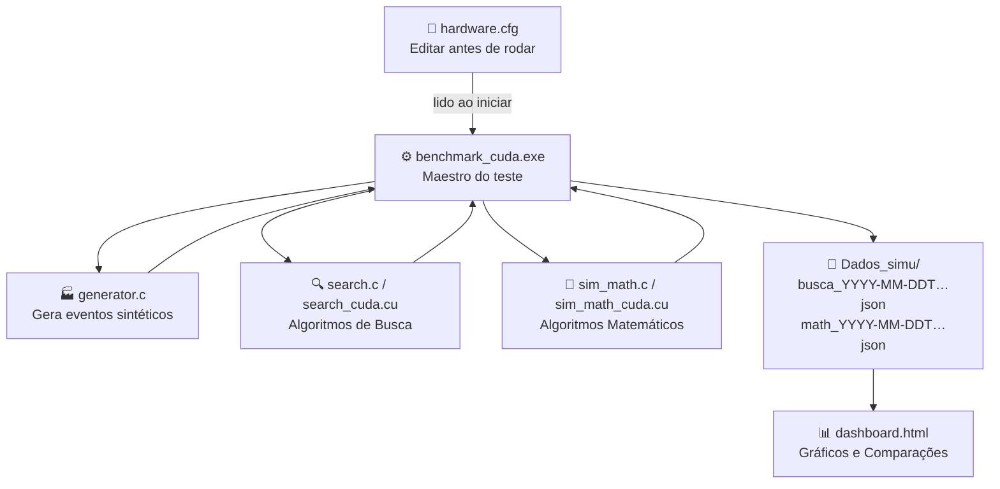

---
tags:
  - cuda
  - hpc
  - gpu
  - benchmark
status: em-progresso
descricao: "Benchmarks GPU/CPU com CUDA e OpenMP — engenharia de baixo nível e otimização de performance."
progresso: "8/10"
data_criacao: 2026-04-26
data_atualizacao: 2026-05-02
gerado_por: Claude
tipo: tarefa
agendar: 2026-05-02
bloco: tarde
prioridade: alta
prazo: 2026-05-05
---
# Benchmark CUDA — Índice do Projeto

Bem-vindo ao guia completo do projeto de simulação e benchmark em C/CUDA! Este material foi escrito para ser **extremamente didático e passo a passo**, projetado para quem quer aprender a fundo como hardware e software se conversam, do nível mais básico ao avançado.

> [!info] Dicionário Rápido
> - **Benchmark**: Um teste de desempenho. Imagine colocar vários carros (nossos algoritmos) para correr na mesma pista (nosso computador) para ver qual é o mais rápido e por quê.
> - **Simulação**: Criar dados falsos, mas que se comportam exatamente como o mundo real (ex: simular batimentos cardíacos ou acessos a um site).
> - **CUDA**: Uma tecnologia da NVIDIA que permite usar a Placa de Vídeo (GPU) não para desenhar gráficos de jogos, mas para fazer milhares de cálculos matemáticos ao mesmo tempo.
> - **HPC** (High-Performance Computing): Computação de Alta Performance. É o ato de espremer até a última gota de velocidade do computador.

---

## 🗺️ Fluxo do Projeto (Visão Macro)

---

## 📚 Tópicos de Estudo (Siga a Ordem)

Siga a ordem abaixo para um aprendizado progressivo. Se já domina um assunto, sinta-se livre para pular.

| # | Nota | O que você vai aprender |
|---|------|-------------------------|
| 1 | [[01 - Visao Geral do Projeto\|Visão Geral do Projeto e Arquivos]] | O que estamos construindo e onde está cada peça |
| 2 | [[02 - Estrutura de Dados e Geracao\|Estrutura de Dados (96 bytes) e Geração]] | Como organizar a memória perfeitamente e criar dados realistas |
| 3 | [[03 - Paralelismo na CPU (OpenMP)\|Paralelismo na CPU com OpenMP]] | Usando todos os núcleos do seu processador |
| 4 | [[04 - Sistema de Build\|Sistema de Build (Makefile e .bat)]] | Como transformar texto (código) em um programa executável |
| 5 | [[05 - Fundamentos de GPU\|Fundamentos de Programação em GPU]] | A diferença entre o cérebro da CPU e a força bruta da GPU |
| 6 | [[06 - Algoritmos de Busca na GPU\|Algoritmos de Busca na GPU]] | Procurando agulhas num palheiro gigante com o exército de formigas |
| 7 | [[07 - Algoritmos Matematicos\|Algoritmos Matemáticos na GPU]] | Monte Carlo e Mandelbrot — força bruta matemática |
| 8 | [[08 - Compilacao e Arquitetura CUDA\|Compilação, Arquitetura CUDA e JIT]] | Os bastidores de como a placa de vídeo lê o nosso código |
| 9 | [[09 - Medicao e Resultados\|Medição de Tempo, Outliers e Leis de Amdahl]] | Por que medimos com mediana e os limites do universo da computação |
| 10 | [[10 - Dashboard e Configuracao\|Dashboard e Configuração do hardware.cfg]] | Como configurar o benchmark e interpretar os gráficos |

---

## 🚀 Guia Rápido: Do Zero ao Gráfico

> [!tip] Comparar vários hardwares
> Rode o `benchmark_cuda.exe` em máquinas diferentes (ou com `hardware.cfg` diferente) e carregue **todos** os `.json` gerados no dashboard ao mesmo tempo. A aba "Comparar Hardware" mostrará os gráficos comparativos automaticamente.

---

## 🏷️ Tags do Projeto
#cuda #c #openmp #benchmark #hpc #gpu #dashboard #obsidian
