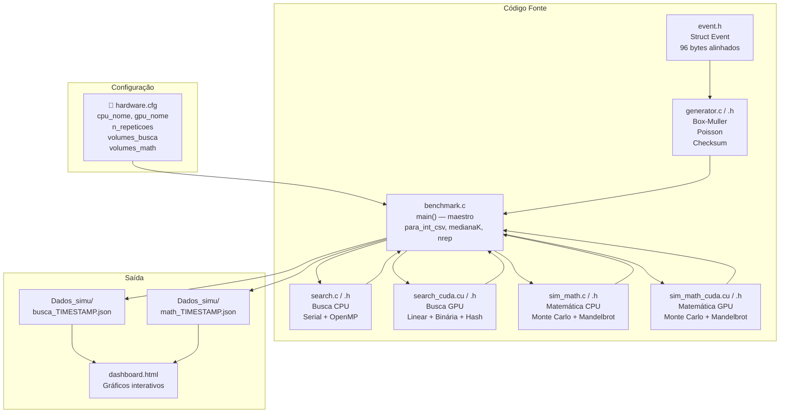
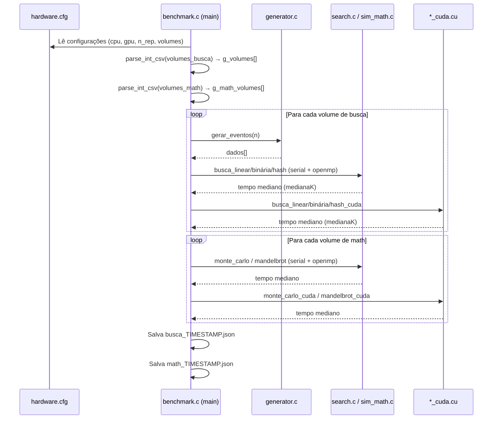

# Visão Geral do Projeto

Este projeto é um **benchmark científico** — um teste rigoroso de desempenho. O objetivo é comparar a velocidade de algoritmos de busca e de matemática rodando em diferentes "cérebros" do computador (CPU serial, CPU paralela com OpenMP e GPU NVIDIA com CUDA).

O objetivo acadêmico principal é demonstrar empiricamente (na prática, medindo e provando) as **Leis de Amdahl e Gustafson**.

> [!info] Dicionário Rápido
> - **Empiricamente**: Comprovado através de testes e dados reais, não apenas na teoria.
> - **Lei de Amdahl**: "O quão rápido um carro pode ir se apenas 2 das 4 rodas tiverem motor?" — A velocidade máxima de um programa é limitada pelas partes que **não** podem ser divididas (serializadas). Se 10% do código é serial, não importa quantos núcleos você tenha: o ganho máximo será 10×.
> - **Lei de Gustafson**: "Se temos mais motores, não vamos só chegar mais rápido ao mesmo lugar — vamos carregar um caminhão muito mais pesado!" — Com mais paralelismo, resolvemos problemas **maiores** no mesmo tempo.

---

## Modos de Execução

Imagine que temos a tarefa de carregar 100.000 tijolos de um lugar para outro. Nosso código executa essa tarefa de 4 formas:

| Modo | Tecnologia | Onde roda | Analogia |
|------|-----------|-----------|----------|
| `serial` | C puro, 1 thread | CPU | **1 Operário forte e rápido.** Pega um tijolo por vez. Ótimo para pouco volume. |
| `openmp` | OpenMP, N threads | CPU paralela | **Vários Operários (8 ou 16).** Dividem o trabalho. Às vezes esbarram uns nos outros se não houver organização. |
| `gpu_sim` | C simulando CUDA | CPU | **Treinamento no papel.** A CPU "finge" ser GPU para validar a matemática antes da vida real. |
| `cuda` | CUDA real | GPU NVIDIA | **Exército de 5.000 Formigas.** Cada formiga é fraca, mas juntas movem montanhas instantaneamente. |

---

## Arquitetura do Projeto



---

## Mapa de Arquivos (A Planta da Casa)

```
simulacao/
│
├── 📄 hardware.cfg         → Configuração do usuário: CPU, GPU, repetições e volumes de teste.
│                             Edite aqui antes de rodar o benchmark!
│
├── 📄 event.h              → Struct Event (96 bytes exatos). A "caixa" onde guardamos nossos dados.
│                             Projetada para caber perfeitamente na cache da GPU (32×3 = 96).
│
├── 📄 generator.h / .c     → A fábrica de dados sintéticos. Usa Box-Muller (Gaussiana),
│                             Processo de Poisson (timestamps reais) e Checksum XOR.
│
├── 📄 search.h / .c        → Algoritmos de busca na CPU:
│                             Serial (1 thread) e OpenMP (N threads).
│                             Implementa: Busca Linear, Binária e Hash.
│
├── 📄 search_cuda.h / .cu  → Os mesmos algoritmos de busca, mas para a GPU real.
│                             Arquivos .cu são exclusivos do compilador CUDA (nvcc).
│
├── 📄 sim_math.h / .c      → Algoritmos matemáticos na CPU:
│                             Monte Carlo (estimativa de π) e Fractal de Mandelbrot.
│
├── 📄 sim_math_cuda.h/.cu  → Os mesmos algoritmos matemáticos, acelerados na GPU.
│                             Onde a placa de vídeo humilha a CPU sem piedade.
│
├── 📄 benchmark.c          → O arquivo Principal (main). O maestro da orquestra.
│                             Lê hardware.cfg → gera dados → roda todos os testes →
│                             calcula medianas → salva JSON em Dados_simu/.
│
├── 📄 Makefile             → Receita de compilação para Linux/WSL.
│                             Compile com: make dist (versão otimizada e estática)
│
├── 📄 build_cuda.bat       → Receita de compilação para Windows com NVCC + MSVC.
│                             Execute no PowerShell do Visual Studio.
│
├── 📁 Dados_simu/          → Pasta onde os JSONs de resultados são salvos automaticamente.
│   ├── busca_2026-04-22T…json   (resultado dos testes de busca)
│   └── math_2026-04-22T…json   (resultado dos testes matemáticos)
│
└── 📄 dashboard.html       → Abre no navegador. Arraste os JSONs para visualizar os gráficos.
                              Abas: Busca de Eventos | Panorama Geral | Comparar Hardware
```

---

## Fluxo de Execução do benchmark.c



---

## O que os Dados Finais Mostram?

Ao final, o dashboard apresenta:

- **Speedup**: Quantas vezes um modo foi mais rápido que o serial? `Speedup = T_serial ÷ T_paralelo`
- **Gráficos de linha**: Como o speedup varia com o volume de dados?
- **Comparação de hardware**: Qual CPU/GPU se sai melhor em cada algoritmo?
- **Ranking geral**: Qual combinação hardware+algoritmo domina cada caso de uso?

> [!success] Resultado esperado
> - **Monte Carlo / Mandelbrot**: A GPU vence por 50×–500× — problema "Compute Bound" (puro cálculo, sem transferência de dados).
> - **Busca Linear em volumes grandes**: GPU vence por 5×–50× — o volume compensa o custo de transferência PCIe.
> - **Busca Binária / Hash em volumes pequenos**: CPU pode ganhar — "Memory Bound" + latência PCIe dominam.

---
⬅️ Voltar para: [[Workbench/Faculdade/Arquitetura_2°_Artigo/parallel-laws-benchmark/Benchmark_CUDA/00 - Indice do Projeto]]
➡️ Próximo: [[02 - Estrutura de Dados e Geracao]]
