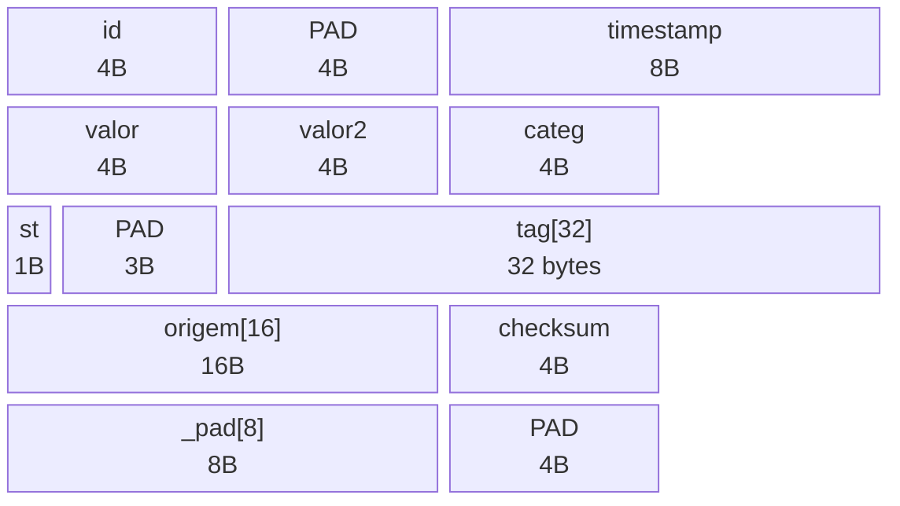
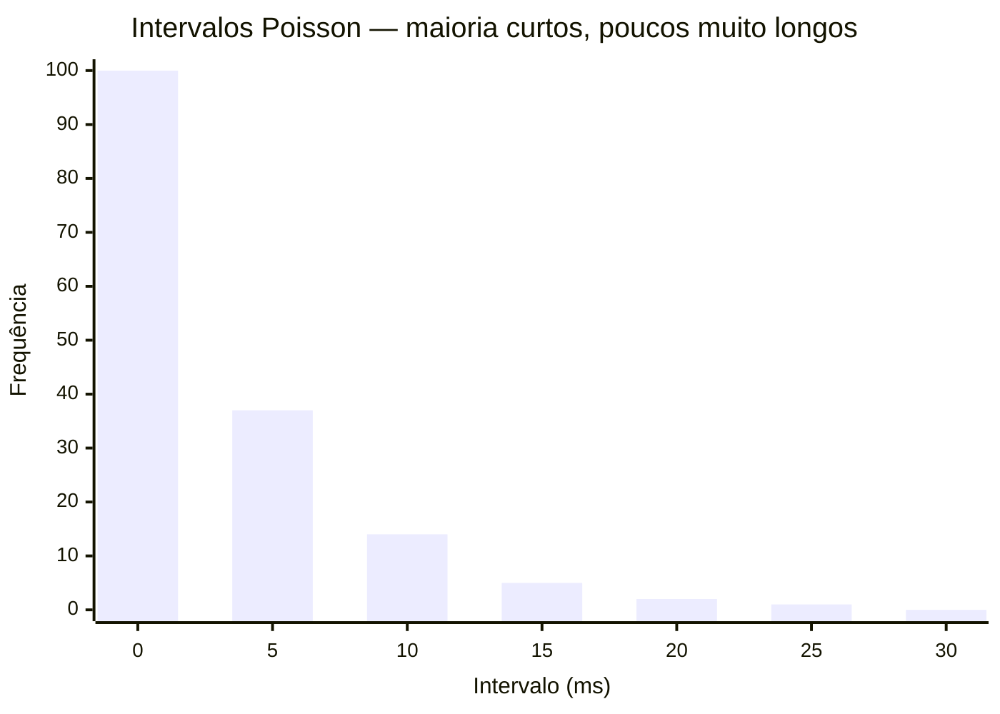

# Estrutura de Dados e Geração (Deep Dive)

Neste documento vamos descer ao nível dos átomos do computador. Vamos entender como estruturamos nossos dados na memória e a matemática por trás da geração de dados realistas.

---

## A Engenharia da Struct `Event` — O Alinhamento Perfeito

A otimização de cache é a espinha dorsal da performance. Nossa estrutura de dados (`struct`) foi desenhada matematicamente para ocupar **exatos 96 bytes** — nem um a mais, nem um a menos.

### O que é uma Cache Line, afinal?

Antes de falar do "porquê 96", precisa entender a hierarquia de memória da GPU. Você nunca lê 1 byte da VRAM. O hardware sempre puxa **blocos fixos** mínimos.

```
┌─────────────────────────────────────────────────┐
│  Hierarquia de memória da GPU NVIDIA            │
│                                                 │
│   Threads (no SM)                               │
│        ↓                                        │
│   ┌──────────────┐                              │
│   │ L1 / Shared  │  ← por SM, 128 KB típico    │
│   │  cache line = 128 B (4 sectors)            │
│   └──────────────┘                              │
│        ↓                                        │
│   ┌──────────────┐                              │
│   │     L2       │  ← global, todos os SMs     │
│   │  cache line = 128 B (4 sectors)            │
│   └──────────────┘                              │
│        ↓                                        │
│   ┌──────────────┐                              │
│   │ VRAM / HBM   │  ← memória global da GPU    │
│   └──────────────┘                              │
│                                                 │
│  ⚠ GPU NÃO tem L3 (isso é coisa de CPU).       │
└─────────────────────────────────────────────────┘
```

Dois termos centrais:

- **Sector = 32 bytes.** Granularidade real da transação no controlador de memória. Quando uma thread sozinha pede 1 byte, o hardware traz 32 B inteiros pra L1.
- **Cache line = 128 bytes = 4 sectors.** Unidade de organização da L1 e L2. Quando o warp (32 threads) acessa endereços contíguos, os 4 sectors são agrupados em 1 linha cheia, num único tráfego de 128 B.

> [!info] Por que 96 bytes? — A regra de ouro em duas camadas
> **Camada 1 — per-thread (a regra que importa de fato):**
> O tamanho da struct precisa ser **múltiplo de 32 B (sector)**. Como $96 = 3 \times 32$ ✓, cada thread carrega exatamente 3 sectors limpos, sem cruzar fronteiras de sector de forma desperdiçada.
>
> **Camada 2 — warp agregado (consequência automática):**
> 32 threads × 96 B = **3072 B = 24 linhas de 128 B exatas**. O warp inteiro consome um número redondo de linhas L1, sem byte morto na última transação. Isso é o **Acesso Coalescido**.
>
> Se a struct fosse 100 B: não é múltiplo de 32 → cada thread dispara um sector "quebrado" no fim, e o agregado fica desalinhado. **Esse é o problema real do número "feio"**, não "puxar cache line pela metade".

### Layout em memória (struct = 96 B, linha = 128 B)

Vendo na régua, com 4 structs consecutivas e 3 linhas de cache sobrepostas:

```
Endereço:  0        96       192      288      384
           │        │        │        │        │
Structs:   [── s0 ──][── s1 ──][── s2 ──][── s3 ──]
              96 B     96 B      96 B      96 B

Linhas:    [───── L0 ─────][───── L1 ─────][───── L2 ─────]
                128 B            128 B           128 B
           0              128            256             384
```

| Linha | Range bytes | Conteúdo |
|-------|-------------|----------|
| **L0** | 0 – 127   | s0 inteiro (96 B) + **primeiros 32 B de s1** |
| **L1** | 128 – 255 | últimos 64 B de s1 + **primeiros 64 B de s2** |
| **L2** | 256 – 383 | últimos 32 B de s2 + **s3 inteiro (96 B)** |

O padrão se repete a cada **3 linhas / 4 structs** (LCM de 96 e 128 = 384 B).

> [!tip] Isso é desperdício?
> **Não.** O "rabo" do struct N que aparece na mesma linha que a "cabeça" do struct N+1 não é byte morto — é justamente o que **outra thread do mesmo warp** vai consumir no próximo acesso. Como o warp inteiro lê em paralelo, o hardware carrega L0 uma vez e serve thread 0 (s0 inteiro) + parte da thread 1 (32 B iniciais de s1). Toda a linha pertence a *alguém* do warp.

### Comparação rápida — 96 vs 100 vs 128

| Struct | Múltiplo de 32? | 32 × struct      | Coalesce?                                  |
|--------|-----------------|------------------|--------------------------------------------|
| 96 B   | ✓ (3×32)        | 3072 = 24 linhas | ✅ ótimo (escolha do projeto)              |
| 100 B  | ✗               | 3200 = 25 linhas | ❌ sectors quebrados, desperdício per-thread |
| 128 B  | ✓ (4×32)        | 4096 = 32 linhas | ✅ ideal teórico (1 thread = 1 linha)      |

96 B é o sweet spot: **economiza 25% de memória vs 128 B** mantendo coalescência limpa.

### Mapa de Memória da Struct (96 bytes)

```
Offset  │ Campo              │ Tipo         │ Bytes │ Notas
────────┼────────────────────┼──────────────┼───────┼──────────────────────────────
  0     │ id                 │ uint32_t     │  4    │ Identificador único
  4     │ [padding implícito]│ —            │  4    │ Compilador alinha timestamp em múltiplo de 8
  8     │ timestamp          │ int64_t      │  8    │ Microssegundos — precisa de offset 8
 16     │ valor              │ float        │  4    │ Dado principal (ex: temperatura)
 20     │ valor_secundario   │ float        │  4    │ Dado auxiliar
 24     │ categoria          │ Categoria    │  4    │ Enum = int32 por baixo dos panos
 28     │ status             │ uint8_t      │  1    │ Flag de estado (1 byte!)
 29     │ [padding implícito]│ —            │  3    │ Alinha tag[] no byte 32
 32     │ tag[32]            │ char[32]     │ 32    │ Nome/rótulo do evento
 64     │ origem[16]         │ char[16]     │ 16    │ Fonte do evento
 80     │ checksum           │ uint32_t     │  4    │ Assinatura de integridade XOR
 84     │ _pad[8]            │ uint8_t[8]   │  8    │ Padding explícito para chegar em 92
 92     │ [padding implícito]│ —            │  4    │ Alinha struct em múltiplo de 8 → total = 96 ✅
────────┴────────────────────┴──────────────┴───────┴──────────────────────────────
                                    TOTAL = 96 bytes ✅
```



> [!warning] O que é Padding?
> É o "plástico bolha" invisível que o compilador injeta automaticamente entre campos para garantir alinhamento. Você não declara — ele aparece sozinho. A única exceção é o `_pad[8]` final, que nós mesmos colocamos para forçar o tamanho exato a 96.

### O Código da Struct

```c
typedef struct {
    uint32_t   id;               // Offset  0 | 4 bytes
    // [4 bytes de padding implícito aqui]
    int64_t    timestamp;        // Offset  8 | 8 bytes
    float      valor;            // Offset 16 | 4 bytes
    float      valor_secundario; // Offset 20 | 4 bytes
    Categoria  categoria;        // Offset 24 | 4 bytes (enum = int32)
    uint8_t    status;           // Offset 28 | 1 byte
    // [3 bytes de padding implícito aqui]
    char       tag[32];          // Offset 32 | 32 bytes
    char       origem[16];       // Offset 64 | 16 bytes
    uint32_t   checksum;         // Offset 80 | 4 bytes
    uint8_t    _pad[8];          // Offset 84 | 8 bytes (nosso padding explícito)
    // [4 bytes de padding implícito no final pela regra do compilador]
} Event; // Total: 96 bytes exatos ✅
```

---

## Matemática da Geração de Dados (`generator.c`)

Para que o benchmark seja cientificamente válido, os dados devem se comportar como dados reais — não como sequências previsíveis (`1, 2, 3, 4...`). Usamos três técnicas matemáticas:


---

### 1. Transformada de Box-Muller (A Curva de Sino)

> [!info] Por que não usar `rand()` direto?
> `rand()` gera números **uniformes** (cada valor tem igual chance). Mas dados reais (temperatura corporal, latência de rede, voltagem de sensor) seguem uma **distribuição Gaussiana** (Curva de Sino): a maioria dos valores fica perto da média, e os extremos são raros.

#### A Evolução do Pensamento

1. **Tentativa 1 — Soma de dados**: Somar 12 números aleatórios → resultado converge para Gaussiana (Teorema Central do Limite). *Problema*: 12 chamadas de `rand()` para gerar **1** número. Caro para GPU!

2. **Tentativa 2 — Box-Muller clássico**: Usa Seno e Cosseno para "dobrar" um quadrado em um círculo. *Problema*: `sin()` e `cos()` são "pedágios" caros (dezenas de clocks do processador).

3. **Solução final — Rejeição Polar**: Troca sin/cos por uma divisão e rejeição geométrica. Mais rápido e usado no nosso código!

```
┌─────────────────────────────────────────────┐
│  Algoritmo de Rejeição Polar (Box-Muller)   │
│                                             │
│  1. Sorteia (u, v) no quadrado [-1,+1]²    │
│  2. Calcula s = u² + v²                     │
│  3. Se s ≥ 1 ou s = 0: descarta e volta    │  ← rejeição (descarta pontos fora do círculo)
│  4. fator = √(-2·ln(s) / s)                │
│  5. Resultado = média + desvio × (u × fator)│
└─────────────────────────────────────────────┘
```

```c
static float gaussiana(float media, float desvio) {
    float u, v, s;
    do {
        u = rand_float() * 2.0f - 1.0f;  // Coordenada X: [-1, +1]
        v = rand_float() * 2.0f - 1.0f;  // Coordenada Y: [-1, +1]
        s = u*u + v*v;                    // Distância² ao centro (Pitágoras)
    } while (s >= 1.0f || s == 0.0f);    // Rejeita pontos fora do círculo unitário

    float fator = sqrtf(-2.0f * logf(s) / s); // A mágica matemática
    return media + desvio * (u * fator);       // Escala para a nossa distribuição
}
```

> [!tip] Animação Interativa
> O arquivo `animacao_gaussiana.html` na pasta do projeto mostra visualmente o processo de Box-Muller em tempo real. Abra no navegador!

---

### 2. Processo de Poisson (Criando o Caos do Tempo Real)

Eventos no mundo real (cliques num site, pacotes de rede, batimentos cardíacos) não seguem intervalos fixos. Eles seguem a **distribuição exponencial do Processo de Poisson**: longos silêncios seguidos de rajadas caóticas.



```c
// Retorna o intervalo até o próximo evento (em microssegundos)
static int64_t intervalo_poisson(double taxa_ms) {
    double u = (double)rand() / RAND_MAX; // Número uniforme entre 0 e 1
    // Inverso da CDF exponencial: -λ × ln(u)
    // u próximo de 1 → ln(u) ≈ 0 → intervalo curto (rajada)
    // u próximo de 0 → ln(u) → -∞ → intervalo longo (silêncio)
    return (int64_t)(-taxa_ms * log(u));
}
```

---

### 3. Checksum e Bitwise Type-Punning

Ao mover dados pela memória RAM a velocidades gigantescas, bits podem ser invertidos por interferência. O **Checksum XOR** cria uma "assinatura de segurança" para detectar corrupção.

> [!info] O que é Type-Punning?
> É o ato de mentir para o compilador: pedir que ele leia um `float` (número decimal) como se fosse um `uint32_t` (inteiro sem sinal), sem converter o valor — acessando os **bits brutos** diretamente.
> O C proíbe operações XOR em floats, mas permite em inteiros. O type-pun contorna essa restrição.

```c
uint32_t checksum_event(const Event *e) {
    return
        e->id ^
        (uint32_t)e->timestamp ^         // Pega os 32 bits inferiores do timestamp
        *(uint32_t*)&e->valor ^           // ← TYPE-PUN: lê os bits brutos do float
        *(uint32_t*)&e->valor_secundario; // ← TYPE-PUN: idem
}
```

> [!warning] Destrinchando `*(uint32_t*)&e->valor`
> 1. **`&e->valor`** → pega o **endereço de memória** onde o float está guardado.
> 2. **`(uint32_t*)`** → mente para o compilador: "este endereço aponta para um inteiro de 32 bits, não um float".
> 3. **`*`** → desreferencia: abre a gaveta e pega os **32 bits brutos**, sem nenhuma conversão matemática.
>
> **Resultado**: XOR sobre os átomos (bits) do float. Feio, gambiarra, e absurdamente rápido.

---
⬅️ Voltar para: [[Workbench/Faculdade/Arquitetura_2°_Artigo/parallel-laws-benchmark/Benchmark_CUDA/00 - Indice do Projeto]]
➡️ Próximo: [[03 - Paralelismo na CPU (OpenMP)]]
