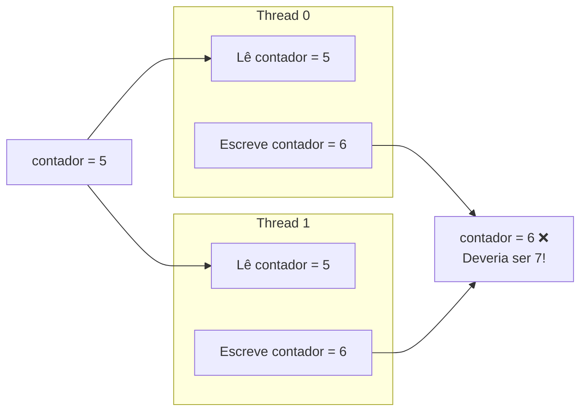
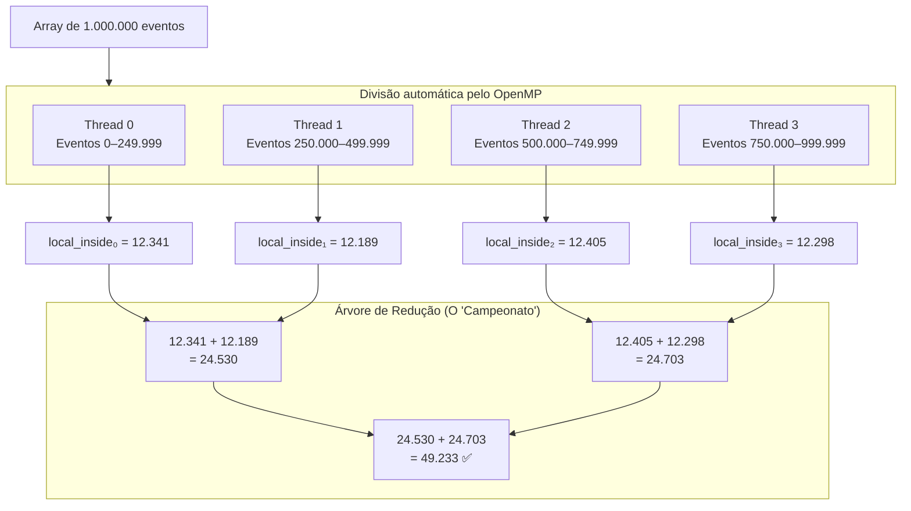
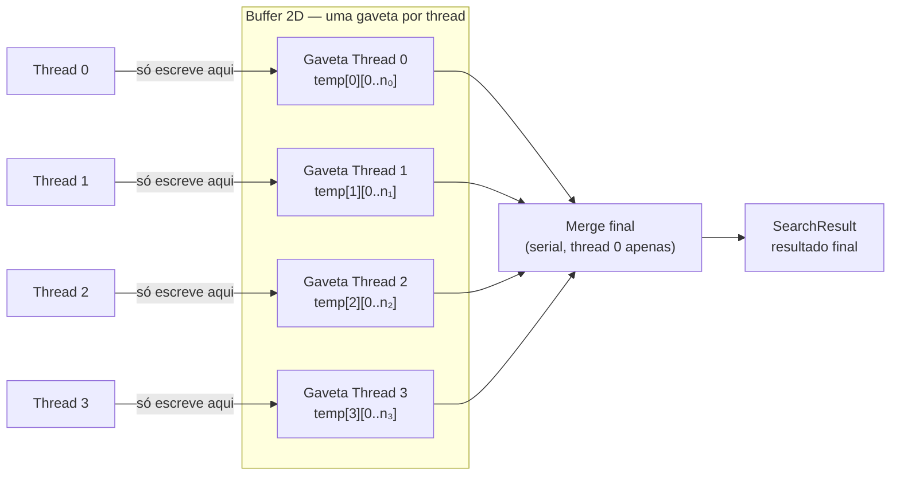
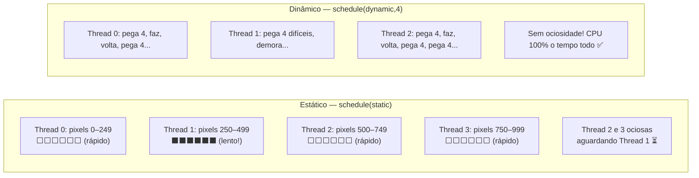

# Paralelismo na CPU (OpenMP) — Engenharia de Hardware

Nosso projeto não usa o OpenMP de forma ingênua. Aplicamos técnicas profundas para evitar a destruição do *Cache Coherency* e maximizar o uso de todos os núcleos do processador.

> [!info] Dicionário Rápido
> - **Thread**: Um trabalhador virtual. Um processador de 8 núcleos pode ter 16 threads simultâneas (com HyperThreading).
> - **Race Condition**: Dois trabalhadores tentando escrever no mesmo endereço de memória ao mesmo tempo — resultado: dado corrompido.
> - **Lock**: Solução ingênua para Race Condition — forçar fila de espera. Destrói o paralelismo.
> - **Cache Coherency**: Quando um núcleo modifica dados, todos os outros núcleos são notificados que o dado na cache deles está desatualizado. Esse "aviso pelo rádio" atrasa a CPU inteira.

---

## Por Que Contar Juntos É Perigoso

O problema mais comum no paralelismo: múltiplas threads somando ao mesmo contador global.



Se Thread 0 e Thread 1 leem o mesmo valor `5` antes de qualquer uma escrever, ambas calculam `5+1=6` e escrevem `6`. Uma soma se perde. Isso é a **Race Condition**.

---

## Solução 1: `reduction` do OpenMP (Para Resultados Numéricos)

A diretiva `reduction` cria cópias **privadas** do contador para cada thread e soma tudo no final — sem fila, sem Lock.



```c
long inside = 0; // Resultado final

#pragma omp parallel num_threads(threads) reduction(+:inside)
{
    // Cada thread tem sua cópia privada de 'inside'
    // (o compilador faz isso automaticamente)
    for (long i = omp_get_thread_num(); i < n; i += threads) {
        if (condicao_satisfeita(dados[i])) {
            inside++; // Seguro! Cada thread incrementa SUA cópia
        }
    }
    // No final: o OpenMP soma todas as cópias na variável global 'inside'
}
// Aqui 'inside' tem o total correto, sem Race Condition
```

> [!success] Por que isso evita False Sharing?
> **False Sharing** acontece quando threads diferentes modificam variáveis que ficam na **mesma Cache Line** (bloco de 64 bytes). Mesmo sem conflito lógico, o hardware força sincronização toda vez.
> A `reduction` mantém as variáveis locais nos **registradores** de cada core — sem Cache Line compartilhada, sem sincronização desnecessária.

---

## Solução 2: Arrays 2D por Thread (Para Retornar Structs)

A `reduction` só funciona com tipos primitivos (somar, subtrair). Quando precisamos retornar os **eventos encontrados** (ponteiros para structs), gerenciamos a memória manualmente com um array 2D:



```c
// Aloca uma gaveta de resultado para cada thread
Event ***temp   = malloc(threads * sizeof(Event **));
int    *counts  = calloc(threads, sizeof(int));

for (int t = 0; t < threads; t++)
    temp[t] = malloc(n * sizeof(Event *)); // Pior caso: todos os eventos

#pragma omp parallel for num_threads(threads)
for (int i = 0; i < n; i++) {
    int tid = omp_get_thread_num(); // "Qual é o meu crachá?"

    if (evento_satisfaz_condicao(&dados[i])) {
        // Thread 'tid' só escreve na PRÓPRIA gaveta — zero conflito!
        temp[tid][ counts[tid]++ ] = &dados[i];
    }
}

// Merge serial (barato — só consolida ponteiros)
for (int t = 0; t < threads; t++)
    for (int j = 0; j < counts[t]; j++)
        resultado[total++] = temp[t][j];
```

---

## Escalonamento de Tarefas (Scheduling)

> [!info] Analogias
> - **Estático**: Buffet a quilo — você já sabe quanto vai comer antes de sentar. Simples e eficiente para trabalho uniforme.
> - **Dinâmico**: Rodízio — você pega o que tem no prato, come, e pede mais quando acabar. Essencial quando pedaços têm tamanhos diferentes.



Para buscas (trabalho uniforme por item), o padrão estático é ideal. Para o **Mandelbrot**, onde o centro do fractal exige 256× mais iterações que as bordas, usamos `schedule(dynamic, 4)`:

```c
#pragma omp parallel for num_threads(threads) \
    reduction(+:total) \
    schedule(dynamic, 4)  // ← cada thread pega 4 linhas por vez, dinamicamente
for (int py = 0; py < lado; py++) {
    for (int px = 0; px < lado; px++) {
        // Conta as iterações do fractal para este pixel
        // (pode ser 1 iteração nas bordas ou 256 no centro)
        total += mandelbrot_iter(px, py, lado);
    }
}
```

> [!success] Resultado com `schedule(dynamic, 4)`
> Todos os núcleos ficam ocupados 100% do tempo, balanceando automaticamente os pixels "difíceis" (centro escuro do fractal) e os "fáceis" (bordas brilhantes). Speedup quase linear com o número de núcleos!

---
⬅️ Voltar para: [[Workbench/Faculdade/Arquitetura_2°_Artigo/parallel-laws-benchmark/Benchmark_CUDA/00 - Indice do Projeto]]
➡️ Próximo: [[04 - Sistema de Build]]
