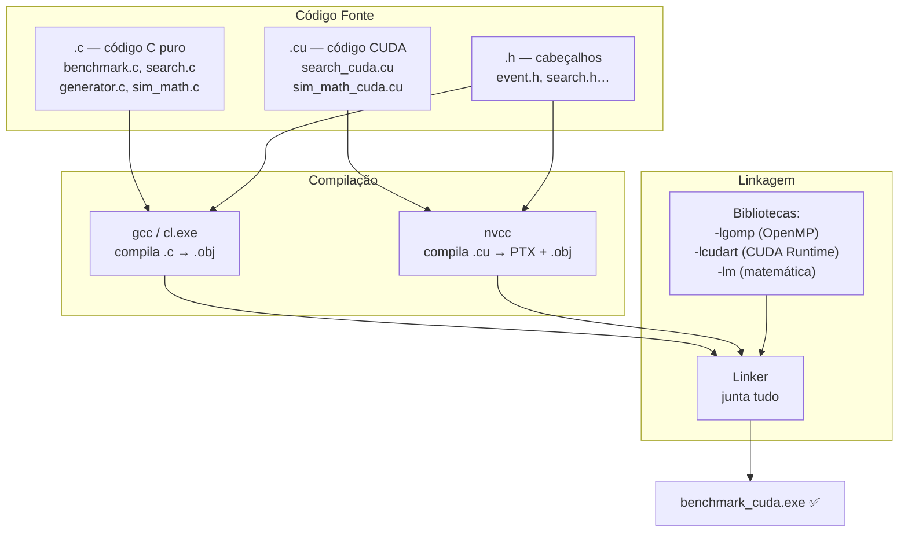
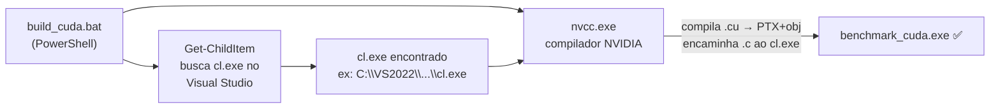
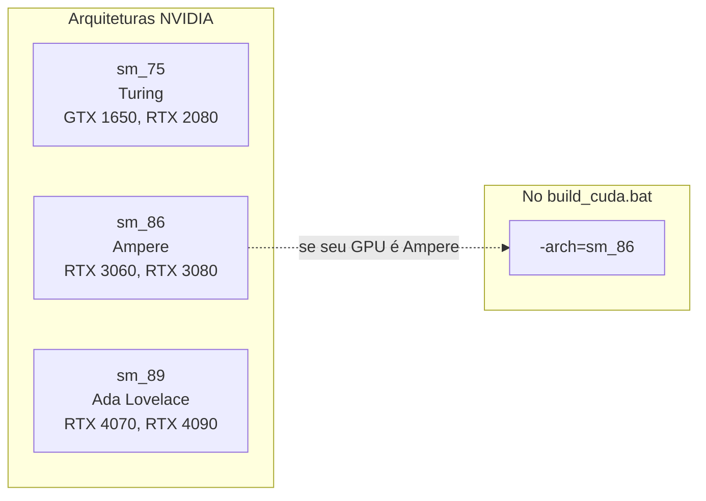

# Sistema de Build (A Receita de Bolo do Compilador)

A compilação deste projeto lida com as complexidades das *Application Binary Interfaces* (ABIs) de Windows e Linux, mais o compilador exclusivo da NVIDIA. Em termos simples: é garantir que peças de fornecedores diferentes (Microsoft, NVIDIA, GCC) se encaixem perfeitamente num único executável.

> [!info] Dicionário Rápido
> - **Compilador**: O tradutor. Pega seu código C e traduz para zeros e uns que a máquina entende. Ex: `gcc` (Linux), `cl.exe` (Windows/MSVC), `nvcc` (NVIDIA/CUDA).
> - **Linker**: O montador. Junta o código compilado do seu projeto com o das bibliotecas externas (OpenMP, matemática, CUDA runtime) num único `.exe`.
> - **Linkagem Estática** (`.a` / `.lib`): O código da biblioteca é **copiado** para dentro do `.exe`. Mais pesado, mas roda em qualquer máquina sem dependências externas.
> - **Linkagem Dinâmica** (`.dll` / `.so`): O `.exe` tem um "bilhete" dizendo onde buscar a biblioteca no sistema. Mais leve, mas quebra se a `.dll` sumir.
> - **ABI (Application Binary Interface)**: A regra do Sistema Operacional que define como funções passam argumentos, onde guardam resultados e como gerenciam a memória. C e C++ têm ABIs **incompatíveis** — daí a necessidade do `extern "C"` (ver [[08 - Compilacao e Arquitetura CUDA]]).

---

## O Pipeline de Compilação



---

## Como Configurar Antes de Compilar

> [!tip] Primeiro passo sempre!
> Antes de compilar, edite o `hardware.cfg` com os dados do seu PC. O benchmark lê este arquivo ao iniciar — sem ele, exibe instruções e encerra.

```ini
# hardware.cfg — exemplo preenchido
cpu_nome=Ryzen 7 4800H
cpu_nucleos=8
cpu_threads=16
gpu_nome=GTX 1650
gpu_cuda_cores=896
ram_gb=16
n_repeticoes=3
volumes_busca=1000,100000,1000000,10000000
volumes_math=100000,500000,1000000
```

---

## Compilar no Linux (`Makefile`)

No Linux (ou WSL — Windows Subsystem for Linux), a compilação é limpa e simples:

```bash
# Compilar versão otimizada + estática (sem dependências externas):
make dist

# O que o 'make dist' faz internamente:
gcc -O3 -march=native -Wall      \  # Nível máximo de otimização
    -fopenmp                     \  # Ativa OpenMP (paralelismo CPU)
    -static -s                   \  # Linka tudo dentro do exe, remove debug info
    -o benchmark_dist            \  # Nome do arquivo final
    benchmark.c search.c         \  # Nossos arquivos
    generator.c sim_math.c       \
    -lgomp -lpthread -lm            # Bibliotecas externas
```

> [!info] Flags importantes
> - **`-O3`**: "Otimize com tudo que a física permitir." O compilador reorganiza loops, faz inlining, vetoriza operações automaticamente.
> - **`-march=native`**: "Compile para este processador específico — use as instruções AVX2/AVX512 que ele suporta." O executável pode não rodar em CPUs mais antigas.
> - **`-static`**: Cola todas as bibliotecas (.a) dentro do exe. Um arquivo que funciona em qualquer Linux, mesmo sem OpenMP instalado.
> - **`-s` (strip)**: Remove a "tabela de símbolos" (metadados de debug). Reduz o tamanho do exe de ~10 MB para alguns KB.

---

## Compilar no Windows (`build_cuda.bat`)

O Windows é mais complexo: o compilador oficial (`cl.exe` do Visual Studio) fica escondido em pastas profundas, e o `nvcc` da NVIDIA precisa ser apresentado a ele.



```powershell
# Passo 1: Achar o compilador da Microsoft (escondido nas entranhas do Visual Studio)
$cl = (Get-ChildItem 'C:\Program Files\Microsoft Visual Studio' `
       -Recurse -Filter cl.exe | Select-Object -First 1).FullName

# Passo 2: Chamar o nvcc com todos os parâmetros
nvcc.exe `
    -O2                    `  # Otimização nível 2
    -arch=sm_86            `  # Arquitetura da GPU: RTX 3000 = sm_86, GTX 1650 = sm_75
    -ccbin $cl             `  # "Apresenta" o cl.exe ao nvcc
    -DHAS_CUDA             `  # Define a macro que ativa o código CUDA no benchmark.c
    -Xcompiler '/O2,/openmp,/W3'  `  # ← O Truque Jedi (ver abaixo)
    benchmark.c search.c generator.c sim_math.c `
    search_cuda.cu sim_math_cuda.cu `
    -o benchmark_cuda.exe
```

> [!warning] O Truque Jedi do `-Xcompiler`
> O `nvcc` só sabe compilar código CUDA. Para o código C normal, ele delega ao `cl.exe`.
> Mas como passar flags específicas do Windows (`/openmp`) ao `cl.exe` via `nvcc`?
>
> O parâmetro `-Xcompiler` é um **bypass**: ele coloca um "bilhete por baixo da porta" do `cl.exe`:
> ```
> nvcc → "ei cl.exe, quando você compilar os .c, use estas flags:"
>         /O2     = otimização máxima da Microsoft
>         /openmp = ativa OpenMP no código C
>         /W3     = avisos de nível 3
> ```
> No Linux, o equivalente seria apenas `-Xcompiler "-fopenmp"` — muito mais simples!

---

## Arquiteturas CUDA (`-arch=sm_XX`)



| GPU | Geração | `sm_XX` | Flag |
|-----|---------|---------|------|
| GTX 1650, GTX 1660 | Turing | sm_75 | `-arch=sm_75` |
| RTX 3060, RTX 3070, RTX 3080 | Ampere | sm_86 | `-arch=sm_86` |
| RTX 4060, RTX 4070, RTX 4090 | Ada Lovelace | sm_89 | `-arch=sm_89` |

> [!tip] Como descobrir o `sm_XX` da sua GPU?
> Execute no PowerShell (Windows) ou terminal (Linux):
> ```bash
> nvidia-smi --query-gpu=compute_cap --format=csv
> # Saída: 8.6  →  sm_86
> ```

---

## Evolução: CMake (O Futuro do Projeto)

`Makefile` e `.bat` são sapatos sob medida — não servem em outro pé. Para projetos maiores ou multiplataforma, usa-se o **CMake**, que detecta o hardware e gera a receita automaticamente:

```cmake
cmake_minimum_required(VERSION 3.18)
project(benchmark_cuda LANGUAGES C CUDA)

enable_language(CUDA)

add_executable(benchmark_cuda
    benchmark.c search.c generator.c sim_math.c
    search_cuda.cu sim_math_cuda.cu
)

set_target_properties(benchmark_cuda PROPERTIES
    CUDA_ARCHITECTURES "native"      # Detecta a GPU automaticamente!
    CUDA_SEPARABLE_COMPILATION ON    # Permite múltiplos .cu organizados
)

find_package(OpenMP REQUIRED)
target_link_libraries(benchmark_cuda OpenMP::OpenMP_C)
```

> [!success] `CUDA_ARCHITECTURES "native"` vs `-arch=sm_86`
> Com CMake + `native`, você **nunca mais precisa adivinhar** qual `sm_XX` usar. O CMake conversa com o driver NVIDIA e injeta a arquitetura exata da placa instalada. Sem erro, sem recompilação.

---
⬅️ Voltar para: [[Workbench/Faculdade/Arquitetura_2°_Artigo/parallel-laws-benchmark/Benchmark_CUDA/00 - Indice do Projeto]]
➡️ Próximo: [[05 - Fundamentos de GPU]]
