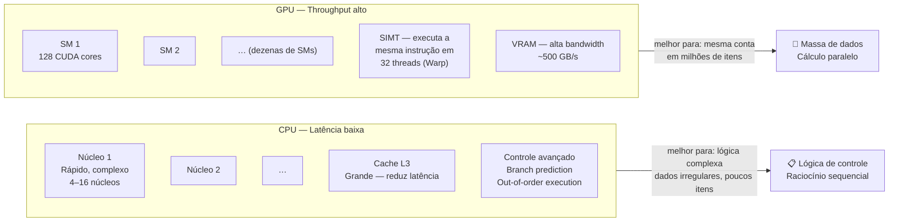
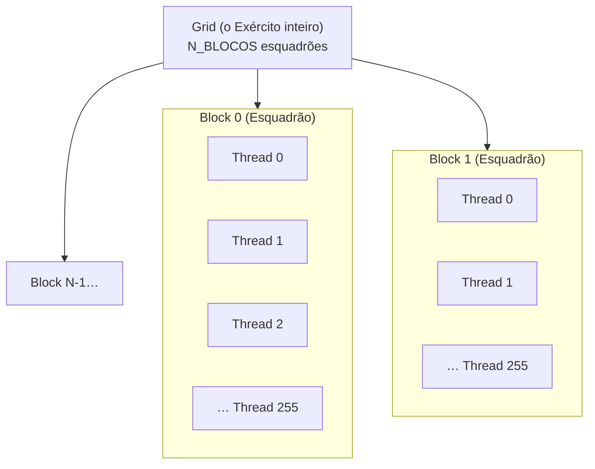
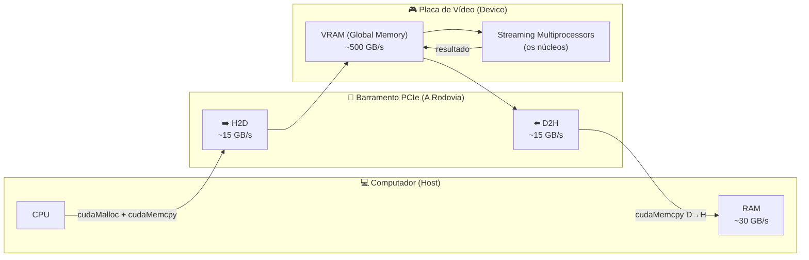
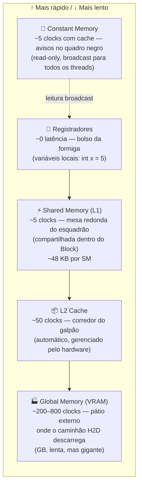
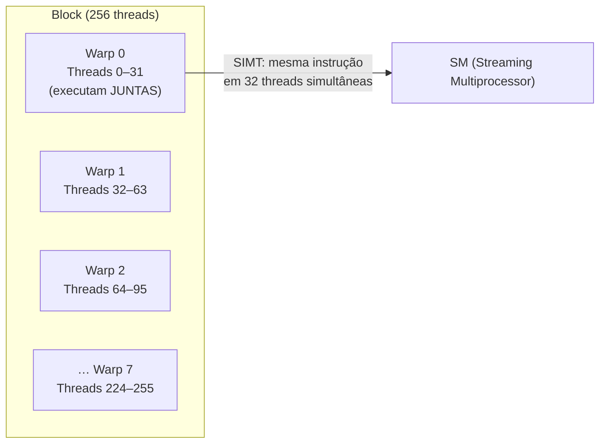

# Fundamentos de GPU — Arquitetura NVIDIA

Para programar na GPU, você precisa esquecer como a CPU funciona. A CPU é como um **Professor Universitário**: faz contas complexíssimas rapidamente, mas trabalha sozinho. A GPU é como um **Exército de 10.000 Formigas**: cada formiga é simples, mas trabalhando juntas elas movem montanhas num instante.

---

## CPU vs GPU — A Filosofia do Design



---

## A Logística do Exército (Grid → Block → Thread)

Quando a CPU ordena que a GPU execute uma missão (Kernel), ela organiza o exército em hierarquia:



> [!info] Por que 256 threads por bloco?
> - Múltiplo de **32** (tamanho do Warp) — nunca desperdiça capacidade do SM.
> - **256** é o padrão da indústria: memória compartilhada suficiente, ocupância alta.
> - Valores maiores (512, 1024) podem reduzir a ocupância se o kernel usar muitos registradores.

### A Fórmula Mágica do `N_BLOCOS`

```c
const int THREADS_POR_BLOCO = 256;

// Divisão com arredondamento para CIMA (Teto / Ceiling Division)
// Garante que todos os elementos sejam cobertos
const int N_BLOCOS = (n + THREADS_POR_BLOCO - 1) / THREADS_POR_BLOCO;
```

Exemplo: $n = 1000$ eventos

$$N_{blocos} = \left\lceil \frac{1000}{256} \right\rceil = \left\lfloor \frac{1000 + 255}{256} \right\rfloor = \left\lfloor \frac{1255}{256} \right\rfloor = 4 \text{ blocos}$$

$4 \times 256 = 1024$ threads acionadas, mas só 1000 têm trabalho. As 24 extras verificam `if (id >= n) return;` e saem imediatamente — sem custo.

```c
__global__ void kernel_exemplo(const Event* dados, int n, ...) {
    int id = blockIdx.x * blockDim.x + threadIdx.x; // "Qual meu número de crachá global?"
    if (id >= n) return; // As 24 formigas extras vão pra casa

    // Cada formiga processa UM item — o dela
    processar(dados[id]);
}
```

---

## O Caminho dos Dados e o Gargalo PCIe



> [!warning] O Calcanhar de Aquiles da GPU
> A VRAM processa dados a **~500 GB/s** internamente. Mas o barramento PCIe que liga o computador à GPU transfere apenas **~15 GB/s** — 33× mais lento.
>
> **Consequência (Lei de Amdahl)**: Se a transferência demora 2 segundos e o kernel GPU demora 0.001 segundo, o speedup total é de apenas $2.001 / 2.000 ≈ 1.0005$. A GPU mal ajudou!
>
> **Solução (Lei de Gustafson)**: Problemas **gigantes** de cálculo puro (Monte Carlo com 10M amostras, Mandelbrot) amortizam o custo de transferência e a GPU vence com folga.

---

## Hierarquia de Memória da GPU



| Memória | Latência | Tamanho | Quem acessa | Como usar |
|---------|----------|---------|-------------|-----------|
| Registradores | ~0 clocks | ~256 KB/SM | 1 thread | Variáveis locais automáticas |
| Shared Memory | ~5 clocks | 48–96 KB/SM | Todas as threads do bloco | `__shared__ int arr[256]` |
| L2 Cache | ~50 clocks | 4–40 MB | Todas as threads | Automático (hardware) |
| Global Memory (VRAM) | ~800 clocks | GB | Todas as threads | `cudaMalloc` + `cudaMemcpy` |
| Constant Memory | ~5 clocks* | 64 KB | Todas as threads (read-only) | `__constant__ float val` |

> [!tip] Por que a Shared Memory é tão importante?
> A Shared Memory é a chave da **Redução Paralela** (ver [[06 - Algoritmos de Busca na GPU]]). Ao invés de 256 threads fazerem `atomicAdd` na VRAM lenta (800 clocks × 256 = 204.800 clocks!), elas colaboram na Shared Memory rápida e só uma delas faz o `atomicAdd` final. Speedup de ~256× nessa operação!

---

## O Warp: A Menor Unidade Real de Execução



> [!warning] Divergência de Warp (O Inimigo do CUDA)
> ```c
> // PROBLEMÁTICO: metade do Warp vai por um caminho, metade por outro
> if (threadIdx.x % 2 == 0) {
>     faz_coisa_rapida();  // threads 0,2,4,6… executam isso
> } else {
>     faz_coisa_lenta();   // threads 1,3,5,7… executam isso
> }
> ```
> Quando threads do mesmo Warp tomam caminhos diferentes (`if/else`), a GPU **serializa** — executa um caminho de cada vez, desativando as threads que não precisam. O Warp de 32 threads efetivamente vira 2 Warps de 16, perdendo 50% da capacidade!
>
> **Solução**: Organizar os dados para que threads do mesmo Warp sempre tomem o mesmo caminho (Warp Coherency).

---
⬅️ Voltar para: [[Workbench/Faculdade/Arquitetura_2°_Artigo/parallel-laws-benchmark/Benchmark_CUDA/00 - Indice do Projeto]]
➡️ Próximo: [[06 - Algoritmos de Busca na GPU]]
