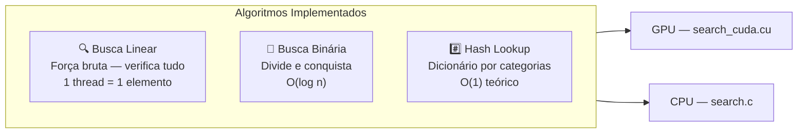
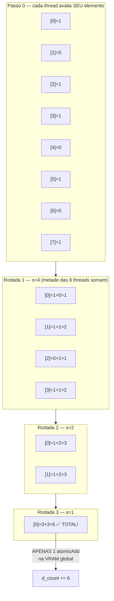
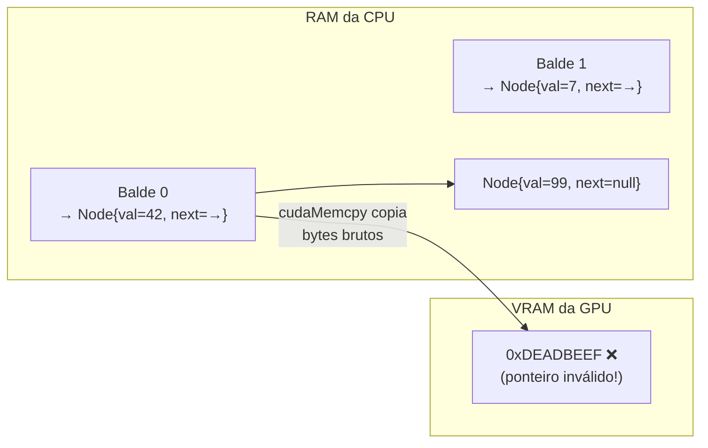

# Algoritmos de Busca na GPU

Agora que entendemos a arquitetura do exército de formigas, vamos ver como elas procuram a "agulha no palheiro" — três algoritmos com abordagens completamente diferentes para a GPU.



---

## 1. Busca Linear: A Força Bruta Massiva

O algoritmo mais simples: cada formiga recebe um elemento do array e verifica se ele está dentro do intervalo `[vmin, vmax]`. Sem comunicação entre formigas, sem dependência de ordem.

### Estrutura do Kernel

```c
__global__ void kernel_busca_linear(
    const Event* __restrict__ dados,    // Array de entrada (VRAM)
    int n,                               // Tamanho do array
    float vmin, float vmax,              // Intervalo de busca
    int* __restrict__ out_indices,       // Índices encontrados (VRAM)
    int* __restrict__ d_count)           // Contador total (VRAM)
```

> [!info] A Promessa do `__restrict__`
> Sem `__restrict__`, o compilador assume que `dados` e `out_indices` podem apontar para a **mesma região de memória** (aliasing). Se isso for possível, ele para a cada acesso para recalcular endereços — gargalo enorme.
>
> `__restrict__` é uma **promessa formal ao compilador**: "Juro que essas duas memórias nunca se sobrepõem. Pode acelerar!"
> Isso desbloqueia otimizações de carregamento em lote (vectorized loads) que podem dobrar o throughput.

### O Problema do Contador Atômico

Todas as formigas que encontrarem um elemento querem incrementar o contador central e gravar o índice. Com 1 milhão de formigas fazendo isso simultaneamente...

```
Thread 0 → encontrou! → atomicAdd(d_count) → escreve índice ← 800 clocks de espera!
Thread 1 → encontrou! → atomicAdd(d_count) → escreve índice ← na fila...
Thread 2 → encontrou! → atomicAdd(d_count) → escreve índice ← na fila...
...1.000.000 formigas na fila...
```

**Solução: Redução Paralela com Shared Memory** (ver seção 2 abaixo).

---

## 2. Redução Paralela — O Torneio de Mata-Mata

O coração da GPU está aqui. Ao invés de 256 threads brigando pela mesma variável global, elas fazem um **torneio interno** na Shared Memory (5 clocks!) e só o vencedor toca na VRAM lenta (800 clocks).



> [!success] O ganho real
> - **Sem redução**: 6 `atomicAdd` serializados na VRAM lenta = 6 × 800 = 4.800 clocks.
> - **Com redução**: 3 rodadas na Shared Memory (3 × 5 = 15 clocks) + 1 `atomicAdd` final (800 clocks) = 815 clocks.
> - **Speedup dessa operação: ~6×** (e com blocos de 256 threads, o ganho é ~256×)

```c
extern __shared__ int sdata[]; // Memória compartilhada alocada dinamicamente

// Cada thread avalia o SEU elemento e anota 1 ou 0 na Shared Memory
int tid = threadIdx.x; // Posição dentro do bloco (0–255)
int gid = blockIdx.x * blockDim.x + tid; // Posição global no array
sdata[tid] = (gid < n && condicao(dados[gid])) ? 1 : 0;

__syncthreads(); // ← PONTO DE ENCONTRO: espera TODAS as 256 threads anotarem

// O Torneio de Mata-Mata (loop logarítmico)
for (int s = blockDim.x >> 1; s > 0; s >>= 1) {
    if (tid < s)
        sdata[tid] += sdata[tid + s]; // Thread 'tid' soma com o adversário '+s'
    __syncthreads();                   // Espera a rodada terminar
}

// Só a Thread 0 sobrou com o total do bloco → 1 único atomicAdd!
if (tid == 0)
    atomicAdd(d_count, sdata[0]);
```

---

## 3. Busca Binária na GPU

A Busca Binária exige que o array esteja **ordenado** e percorre de forma logarítmica: divide o espaço de busca pela metade a cada passo.

> [!warning] Por que a GPU costuma perder na Busca Binária?
>
> ```mermaid
> flowchart LR
>     A["Array ordenado\nna RAM (CPU)"] -->|"cudaMemcpy H2D\n(custo fixo PCIe)"| B["Array na VRAM"]
>     B --> C["Kernel: O(log n)\npor thread"]
>     C --> D["Resultado\n"]
>     D -->|"cudaMemcpy D2H"| E["Resultado\nna CPU"]
> ```
>
> Para **Busca Binária**, o trabalho por thread é $O(\log n)$ — apenas ~20 comparações para 1M de elementos. O kernel termina em microssegundos. Mas a transferência PCIe custa milissegundos.
>
> **Resultado**: Custo fixo de transferência >> custo do kernel. A CPU serial ganha!
>
> Este é um exemplo perfeito da **Lei de Amdahl**: a fração serial (PCIe) domina o tempo total.

---

## 4. Hash Lookup: Achatamento da Matriz (Flattening)

O Hash agrupa eventos por categoria em "baldes" (buckets). Na CPU, implementamos como lista encadeada. O problema: **ponteiros não viajam de carro até a GPU**.

### O Problema dos Ponteiros



O `cudaMemcpy` copia bytes brutos. Um ponteiro `Node *next = 0x7FFF1234` na CPU aponta para uma posição válida na RAM da CPU. Na VRAM da GPU, esse mesmo número `0x7FFF1234` aponta para lixo ou crash.

### A Solução: Flattening (Achatamento)

Transformamos a estrutura encadeada em **3 arrays lineares contíguos** que o caminhão PCIe pode carregar:

```
Estrutura encadeada (CPU):        Arrays lineares (GPU-friendly):
                                   
Balde 0: [42] → [99] → null       keys    = [42, 99, 7, 15, 88]
Balde 1: [7]  → [15] → null  →   starts  = [ 0,  2,  4]
Balde 2: [88] → null               lens    = [ 2,  2,  1]
                                   
                                   Balde 1 começa em starts[1]=2, tem lens[1]=2 elementos
                                   → keys[2..3] = [7, 15] ✅
```

```c
// RODA NA CPU — transforma a estrutura de ponteiros em arrays lineares
int *h_keys   = malloc(total_entries * sizeof(int));
int *h_starts = malloc(n_buckets * sizeof(int));
int *h_lens   = malloc(n_buckets * sizeof(int));

int pos = 0;
for (int b = 0; b < n_buckets; b++) {
    h_starts[b] = pos;
    int cnt = 0;
    for (HashNode *nd = ht->buckets[b]; nd; nd = nd->prox) {
        h_keys[pos++] = nd->key; // "Arranca" o valor do ponteiro e coloca no array linear
        cnt++;
    }
    h_lens[b] = cnt;
}

// Agora sim! Arrays contíguos → cudaMemcpy funciona perfeitamente
cudaMemcpy(d_keys, h_keys, total_entries * sizeof(int), cudaMemcpyHostToDevice);
```

```c
// KERNEL DA GPU — busca usando pura aritmética de índices
__global__ void kernel_hash_lookup(
    const int *keys, const int *starts, const int *lens,
    int n_buckets, int target_bucket, int *d_count)
{
    int tid = blockIdx.x * blockDim.x + threadIdx.x;
    int start = starts[target_bucket];
    int len   = lens[target_bucket];

    if (tid < len) {
        if (keys[start + tid] == target_value) // Aritmética pura — sem ponteiros!
            atomicAdd(d_count, 1);
    }
}
```

> [!warning] O Custo do Flattening
> O processo de "desencadear" os ponteiros roda na CPU antes da GPU começar. Para 10M de eventos, essa travessia serial pode demorar **mais** do que a própria busca na GPU.
>
> Isso ilustra novamente a **Lei de Amdahl**: não importa quão rápida seja a GPU — a preparação serial dos dados na CPU cria um gargalo que limita o speedup total.

---
⬅️ Voltar para: [[Workbench/Faculdade/Arquitetura_2°_Artigo/parallel-laws-benchmark/Benchmark_CUDA/00 - Indice do Projeto]]
➡️ Próximo: [[07 - Algoritmos Matematicos]]
