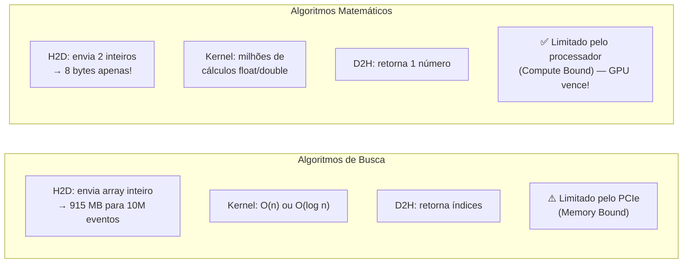
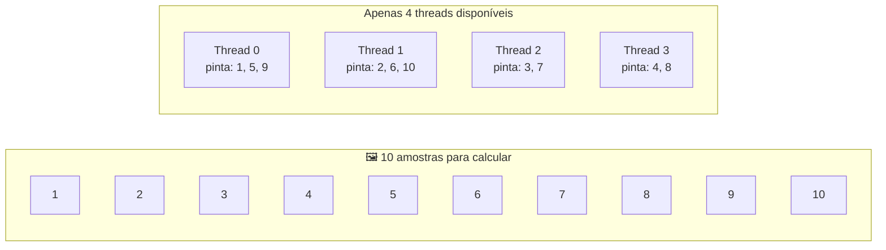
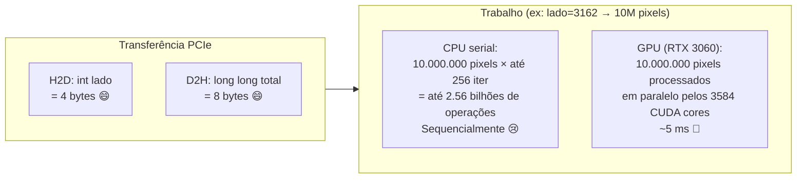
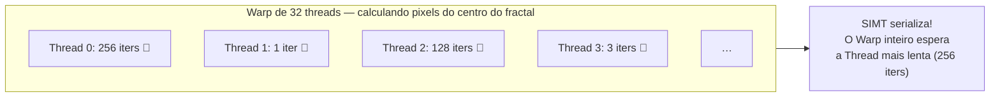

# Algoritmos Matemáticos na GPU

Neste capítulo, abandonamos a busca em bancos de dados e usamos a GPU para o que ela foi **realmente inventada**: força bruta matemática pura. Aqui a GPU não só compete — ela humilha a CPU.

> [!success] Por que a GPU domina aqui?
> Nos algoritmos de **busca**, o custo de transferência PCIe (H2D + D2H) limitava o ganho da GPU.
> Aqui, nos algoritmos matemáticos, enviamos apenas **2 números** (largura e altura, ou número de amostras) para a GPU. O custo de transferência é praticamente **zero**. A GPU entra em modo **Compute Bound** e usa 100% dos seus núcleos para cálculos matemáticos em paralelo.



---

## 1. Monte Carlo $\pi$ — O Problema do Bingo

### A Ideia Matemática

Coloque um círculo de raio 1 dentro de um quadrado de lado 2. Atire dardos aleatoriamente no quadrado:

$$\pi \approx 4 \times \frac{\text{dardos dentro do círculo}}{\text{total de dardos}}$$

```
┌─────────────────────┐
│  .   .   .     .   .│  ← dardo fora do círculo
│   ╔═════════╗   .   │
│   ║  .  . . ║       │
│   ║ .  ● .  ║       │  ← ● = dentro do círculo (x²+y² ≤ 1)
│   ║  . .  . ║   .   │
│   ╚═════════╝       │
│ .       .       .   │
└─────────────────────┘
  Área círculo / Área quadrado = π/4
  → π = 4 × (pontos dentro / total)
```

### O Desafio: Geração de Números Aleatórios

Na CPU, `rand()` usa um **globo de bingo central** — 1 globo para 1 thread. Com 10 milhões de formigas na GPU tentando sortear do mesmo globo, o sistema trava (**State Lock**).

**Solução**: cada thread tem seu **próprio mini-globo** (estado privado do gerador):

```c
// LCG — Linear Congruential Generator
// Matemática simples: multiplica e soma com constantes mágicas
// Cada thread usa seu próprio 'state' → sem conflito!

unsigned int state = (gid * 1664525u + 1013904223u) ^ 0xDEADBEEFu;
//                    ↑ crachá da thread             ↑ "sal" para distribuir os estados

// Avança o estado (gera próximo número pseudo-aleatório)
state = state * 1664525u + 1013904223u;

// Converte para float [0, 1)
float x = (state >> 8) * (1.0f / 16777216.0f);
```

> [!info] Por que `0xDEADBEEF`?
> É um número "feio" em hexadecimal (Dead Beef — "Carne Morta" em inglês) muito amado por hackers e programadores de sistemas. Ele tem uma boa distribuição de bits 0/1 que garante que o estado inicial de cada thread seja bem espalhado, evitando correlações entre threads vizinhas.

### O Grid-Stride Loop — Código Auto-Redimensionável

E se a GPU do usuário tiver menos threads que o número de amostras? O **Grid-Stride Loop** resolve:



```c
int gid    = blockIdx.x * blockDim.x + threadIdx.x; // Meu crachá global
int stride = gridDim.x  * blockDim.x;               // Largura total do exército

long local_inside = 0; // Meu contador privado

// Começo no meu número, pulo de 'stride' em 'stride' — como o pintor do muro!
for (long i = gid; i < n; i += stride) {
    // Avanço meu estado aleatório
    state = state * 1664525u + 1013904223u;
    float x = (float)(state >> 8) / 16777216.0f;
    state = state * 1664525u + 1013904223u;
    float y = (float)(state >> 8) / 16777216.0f;

    if (x*x + y*y <= 1.0f) local_inside++; // Dardo dentro do círculo?
}

// Redução paralela (como no capítulo 6) para somar todos os local_inside
// ...reduction tree...
atomicAdd(d_inside, local_inside);
```

> [!success] Resultado esperado
> - CPU serial (1 thread) com 10M amostras: **~200 ms**
> - CPU OpenMP (16 threads): **~15 ms** — speedup ~13×
> - GPU CUDA (896 cores, GTX 1650): **~2 ms** — speedup ~100×
> - GPU CUDA (3584 cores, RTX 3060): **~0.5 ms** — speedup ~400×

---

## 2. Fractal de Mandelbrot — Compute Bound Puro

### A Matemática

O Fractal de Mandelbrot é gerado iterando a seguinte fórmula nos Números Complexos:

$$z_{n+1} = z_n^2 + c$$

Onde $c$ é a coordenada do pixel e $z_0 = 0$. Se $|z_n|$ crescer além de 2 após $N$ iterações, o ponto **escapa** (pixel brilhante). Se nunca escapar, pertence ao fractal (pixel escuro).

**O problema**: cada pixel pode precisar de 1 a 256 iterações. A CPU processa um pixel por vez. A GPU processa **todos os pixels simultaneamente**!

```c
// Cada thread calcula UM pixel do fractal
__global__ void kernel_mandelbrot(int lado, long long *d_total) {
    int px = blockIdx.x * blockDim.x + threadIdx.x; // Coluna do pixel
    int py = blockIdx.y * blockDim.y + threadIdx.y; // Linha do pixel
    if (px >= lado || py >= lado) return;

    // Converte coordenada do pixel para coordenada do plano complexo [-2, +1] × [-1.5, +1.5]
    float c_re = -2.0f + (float)px * (3.0f / lado);  // Parte real
    float c_im = -1.5f + (float)py * (3.0f / lado);  // Parte imaginária

    float z_re = 0.0f, z_im = 0.0f;
    int iter = 0;

    // Itera até escapar ou atingir o máximo
    while (z_re*z_re + z_im*z_im <= 4.0f && iter < 256) {
        float tmp = z_re*z_re - z_im*z_im + c_re; // z²+c (parte real)
        z_im = 2.0f * z_re * z_im + c_im;         // z²+c (parte imaginária)
        z_re = tmp;
        iter++;
    }

    // Contribui com a contagem total de iterações
    atomicAdd(d_total, (long long)iter);
}
```

### Por Que a GPU Domina Aqui



> [!success] Benchmarks esperados — Mandelbrot (10M pixels)
> | Hardware | Tempo | Speedup vs serial |
> |----------|-------|------------------|
> | CPU serial | ~500 ms | 1× |
> | CPU OpenMP 8 threads | ~65 ms | ~8× |
> | GTX 1650 (896 cores) | ~8 ms | ~62× |
> | RTX 3080 (8704 cores) | ~1 ms | ~500× |
>
> O Mandelbrot é o **caso perfeito** para a GPU — é puro Compute Bound, sem transferência de memória significativa. Exatamente o que a **Lei de Gustafson** prevê!

### Divergência de Warp no Mandelbrot



Este é o **pior caso de divergência**: pixels na borda do fractal saem em 1 iteração, mas pixels no centro precisam de 256. O Warp inteiro espera pelo mais lento.

> [!tip] Mitigação com `schedule(dynamic)`
> Na versão CPU com OpenMP, o `schedule(dynamic, 4)` resolve isso elegantemente — threads que terminam pixels rápidos pegam mais trabalho. Na GPU, técnicas avançadas como **Morton Order** (Z-curve) reorganizam os pixels para que pixels vizinhos (no mesmo Warp) tenham contagens de iteração similares.

---
⬅️ Voltar para: [[Workbench/Faculdade/Arquitetura_2°_Artigo/parallel-laws-benchmark/Benchmark_CUDA/00 - Indice do Projeto]]
➡️ Próximo: [[08 - Compilacao e Arquitetura CUDA]]
