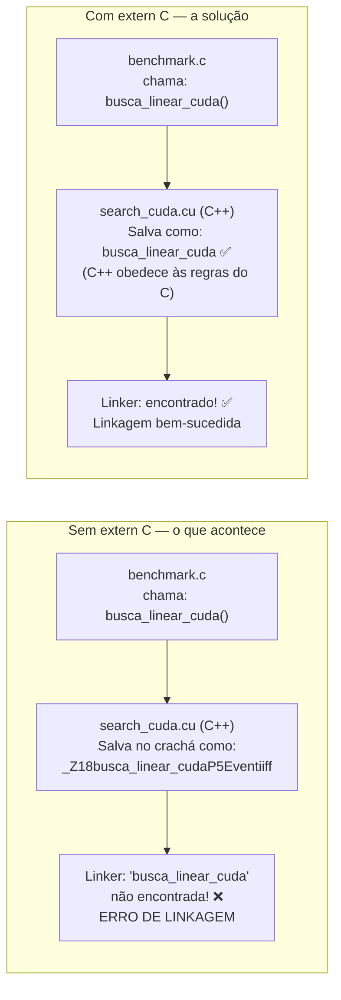
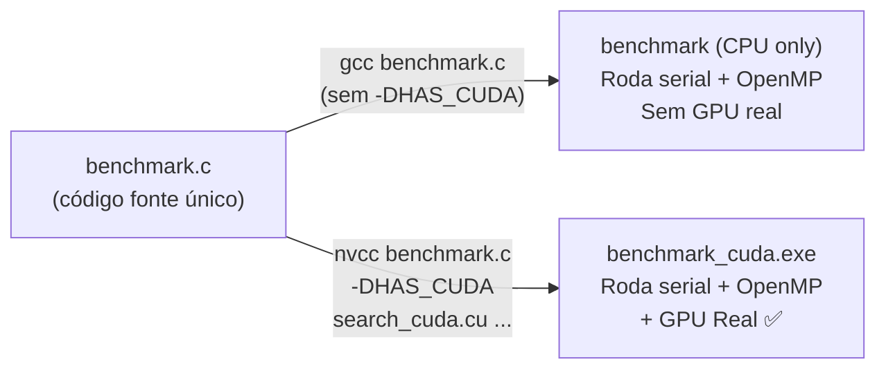
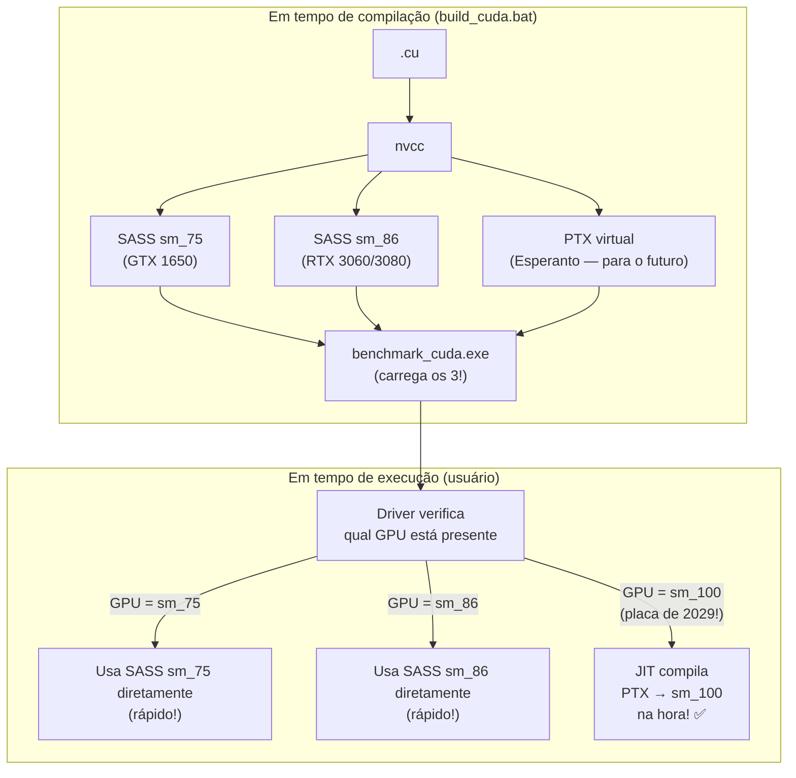
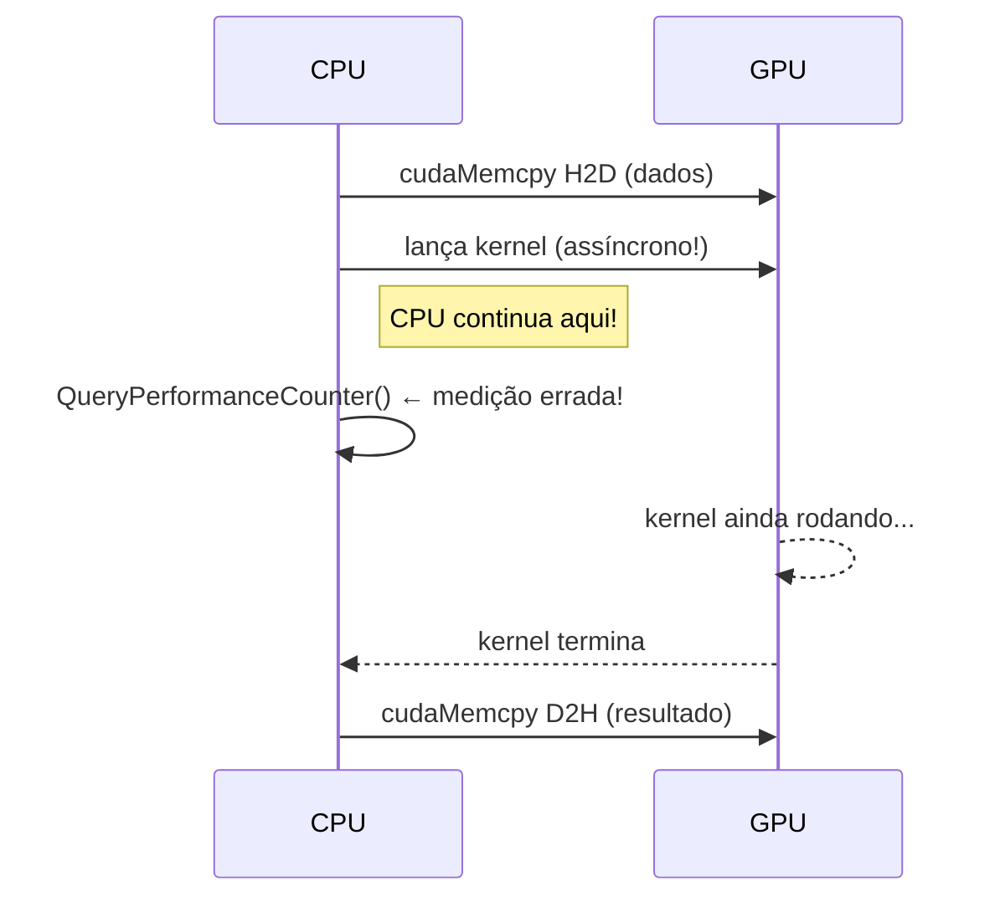

# Compilação, Arquitetura CUDA e JIT

Neste capítulo, veremos as gambiarras geniais necessárias para o código C puro "conversar" com o compilador C++ da NVIDIA, e como garantimos que nosso código rode em placas de vídeo que **nem foram inventadas ainda**.

---

## 1. O Problema da Tradução (ABI Mismatch)

Nosso `benchmark.c` é escrito em **C puro (C99)**, enquanto o compilador NVIDIA (`nvcc`) processa os arquivos de GPU como **C++**. Na superfície parecem iguais. Por baixo dos panos, são inimigos.



> [!info] Por que o C++ "mutila" os nomes?
> O C++ suporta **sobrecarga de funções** (Function Overloading): você pode criar `somar(int a, int b)` e `somar(float a, float b)` com o mesmo nome. Para distingui-las na tabela de símbolos, o compilador C++ **mutila** o nome adicionando informações sobre os tipos:
> - `somar(int, int)` → `_Z5somarII` 
> - `somar(float, float)` → `_Z5somarFF`
>
> O C não tem sobrecarga, então não precisa mutilar. O `extern "C"` força o C++ a usar as regras do C para aquele bloco.

### A Solução: `extern "C"` nos Cabeçalhos

```c
// search_cuda.h — cabeçalho compartilhado entre C e C++

// Se o compilador C++ estiver lendo este arquivo...
#ifdef __cplusplus
extern "C" {  // ...use as regras do C (sem Name Mangling)
#endif

// Esta função é declarada com nome limpo (sem mutilação)
SearchResult busca_linear_cuda(Event *dados, int n,
                               float vmin, float vmax,
                               double *t_total, double *t_kernel);

#ifdef __cplusplus
}  // Fim do bloco — C++ volta ao comportamento normal
#endif
```

> [!tip] `#ifdef __cplusplus` — Como funciona?
> O compilador C++ define automaticamente a macro `__cplusplus`. O compilador C puro **não** define essa macro. Então:
> - **Compilando com `nvcc` (C++)**: o `extern "C" {` é inserido → sem mutilação.
> - **Compilando com `gcc`/`cl.exe` (C)**: o bloco `#ifdef` é ignorado → irrelevante para C.
> Um único `.h` funciona para ambos os compiladores. Elegante!

---

## 2. A Macro `HAS_CUDA` — Compilação Condicional

O mesmo `benchmark.c` compila **com ou sem CUDA**. A macro `HAS_CUDA` decide:

```c
// benchmark.c — trecho

#ifdef HAS_CUDA
    // Este bloco só existe quando compilado com -DHAS_CUDA
    #include "search_cuda.h"
    #include "sim_math_cuda.h"

    // Chama a GPU real
    SearchResult r_cuda = busca_linear_cuda(dados, n, vmin, vmax, &t_total, &t_kernel);
    printf("CUDA:   %.3f ms\n", t_total * 1000.0);
#else
    // Sem CUDA: pula os testes de GPU real, só roda CPU
    printf("(CUDA não disponível nesta build)\n");
#endif
```



---

## 3. JIT, PTX e Forward Compatibility (O Código do Futuro)

Como garantir que nosso programa rode numa placa de vídeo que **ainda não existe**?

> [!info] Dicionário
> - **SASS (Shader Assembly)**: O código de máquina nativo de uma GPU específica. A RTX 3000 fala `sm_86` (Ampere). A GTX 1650 fala `sm_75` (Turing). Incompatíveis entre si.
> - **PTX (Parallel Thread Execution)**: O "Esperanto" da NVIDIA — um Assembly Virtual que qualquer GPU entende.
> - **JIT (Just-In-Time Compiler)**: Um compilador que vive no **driver de vídeo** do seu Windows/Linux. Traduz PTX para o dialeto nativo da GPU no momento em que o programa é iniciado.



### Como Empacotar Múltiplas Arquiteturas

```bash
# Compilação ideal (em build_cuda.bat ou CMake):
nvcc \
  -gencode arch=compute_75,code=sm_75   \  # SASS para GTX 1650
  -gencode arch=compute_86,code=sm_86   \  # SASS para RTX 3060/3080
  -gencode arch=compute_86,code=compute_86 \ # PTX virtual (Forward Compat)
  -o benchmark_cuda.exe benchmark.c search_cuda.cu ...
```

> [!warning] `code=sm_86` vs `code=compute_86`
> - `code=sm_86`: Gera código de máquina **fechado** para Ampere. Rápido, mas não funciona em GPUs futuras.
> - `code=compute_86`: Gera **PTX virtual** para Ampere. O JIT pode traduzi-lo para qualquer GPU mais nova.
> Para Forward Compatibility, você precisa dos **dois** para a sua geração mais recente!

---

## 4. Medição de Tempo na GPU com `cudaEvent`

O cronômetro da CPU (`QueryPerformanceCounter`) não serve para medir o tempo de um kernel GPU — o kernel roda de forma **assíncrona** (em paralelo com a CPU). O código C já continua executando enquanto a GPU ainda está calculando.



A solução correta: **`cudaEvent`** — marcadores de tempo que vivem dentro da GPU:

```c
cudaEvent_t ev_start, ev_stop;
cudaEventCreate(&ev_start);
cudaEventCreate(&ev_stop);

cudaEventRecord(ev_start); // ← Marco de tempo na fila da GPU

kernel<<<N_BLOCOS, THREADS>>>(d_dados, n, ...); // Lança o kernel

cudaEventRecord(ev_stop);   // ← Outro marco
cudaEventSynchronize(ev_stop); // ← ESPERA a GPU terminar (síncrono aqui!)

float ms_gpu = 0.0f;
cudaEventElapsedTime(&ms_gpu, ev_start, ev_stop); // Diferença em milissegundos

cudaEventDestroy(ev_start);
cudaEventDestroy(ev_stop);
```

> [!success] O resultado: dois tempos por medição CUDA
> Nosso benchmark registra para cada teste CUDA:
> - **`cuda_ms`**: tempo total incluindo transferências PCIe (H2D + kernel + D2H) — medido com `agora()` na CPU
> - **`cuda_kernel_ms`**: tempo **exclusivo** do kernel na GPU — medido com `cudaEvent`
>
> A diferença entre os dois é o custo das transferências PCIe, que fica visível nos gráficos do dashboard!

---
⬅️ Voltar para: [[Workbench/Faculdade/Arquitetura_2°_Artigo/parallel-laws-benchmark/Benchmark_CUDA/00 - Indice do Projeto]]
➡️ Próximo: [[09 - Medicao e Resultados]]
