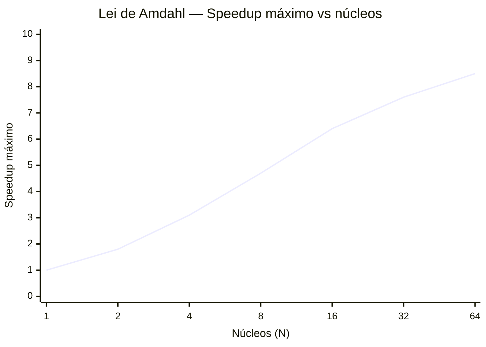

# Medição de Tempo, Outliers e Leis da Computação

Neste benchmark, piscar os olhos demora uma eternidade. Medimos frações minúsculas de tempo — Microssegundos e Milissegundos. Por isso, não podemos usar os relógios normais do computador (como `time()` em C, que só conta segundos inteiros).

---

## 1. O Relógio do Hardware (TSC / QueryPerformanceCounter)

Imagine tentar cronometrar uma corrida de Fórmula 1 usando um relógio de parede com ponteiro de segundos. É impossível saber quem ganhou se os dois carros passarem na linha de chegada no "mesmo segundo".

O `QueryPerformanceCounter` (usado no Windows) não olha para o relógio do Sistema Operacional. Ele é como um **Cronômetro a Laser** grudado diretamente no motor do computador. Ele lê fisicamente um contador de hardware chamado `RDTSC` (Time Stamp Counter).

$$\text{Se o processador tem } 4\text{ GHz} \Rightarrow \text{ele dá 4.000.000.000 batidas por segundo}$$

Esse cronômetro lê e conta cada uma dessas batidas microscopicamente, permitindo gravar tempos em **Microssegundos** com precisão absoluta.

```c
// Nossa função de relógio no benchmark.c
static double agora(void) {
    LARGE_INTEGER t, f;
    QueryPerformanceFrequency(&f); // Quantas batidas por segundo tem este PC?
    QueryPerformanceCounter(&t);   // Quantas batidas se passaram desde o boot?
    return (double)t.QuadPart / (double)f.QuadPart; // Converte para segundos
}
```

---

## 2. O Antivírus, o Cachorro e a Remoção de Outliers

Mesmo com um cronômetro perfeito, o mundo real atrapalha.

> [!warning] O Problema do Outlier
> Imagine que você correu a mesma pista 5 vezes:
> - 1ª vez: **2,0 s**
> - 2ª vez: **2,1 s**
> - 3ª vez: **um cachorro invadiu a pista** → **15,0 s** ← *Outlier!*
> - 4ª vez: **2,0 s**
> - 5ª vez: **2,2 s**
>
> **Média:** $(2,0 + 2,1 + 15,0 + 2,0 + 2,2) / 5 = 4,66\text{ s}$ → Mentira!
> **Mediana:** Ordenando: `[2,0 | 2,0 | `**`2,1`**` | 2,2 | 15,0]` → o do meio é **2,1 s** → Verdade!

No computador, o "Cachorro" é o Antivírus ou o Windows Update que, no meio do benchmark, rouba milissegundos da CPU. Chamamos isso de *Outlier* (Ponto fora da curva).

---

## 3. Estratégia de Medição: Warmup + N Repetições + Mediana

O benchmark usa uma estratégia de 3 etapas para cada medição:


> [!info] Por que o Warmup?
> Na primeira execução, o Sistema Operacional carrega os dados da RAM para a cache do processador (o "aquecimento" — warm-up). Esse custo inicial não deveria aparecer na medição do algoritmo em si. O warmup descarta esse primeiro resultado "frio".

### A função `medianaK` no código

```c
#define MAX_REP 9  // Máximo de repetições configuráveis
static double g_rep_buf[MAX_REP]; // Buffer estático para os tempos

// Ordena 'n' tempos e retorna o do meio (a mediana)
static double medianaK(double *v, int n) {
    // Insertion Sort: simples e rápido para listas pequenas (n ≤ 9)
    for (int i = 1; i < n; i++) {
        double key = v[i];
        int j = i - 1;
        while (j >= 0 && v[j] > key) {
            v[j + 1] = v[j];
            j--;
        }
        v[j + 1] = key;
    }
    // Retorna o elemento do meio — o Outlier fica no final e é ignorado!
    return v[n / 2];
}
```

### Exemplo visual com n_repeticoes = 5

```
Tempos coletados:  [2.1 ms, 2.0 ms, 15.0 ms, 2.2 ms, 2.0 ms]
Após ordenação:    [2.0 ms, 2.0 ms, ➜2.1 ms, 2.2 ms, 15.0 ms]
                                      ↑ índice [5/2] = [2]
Resultado final:    2.1 ms  ✅ (o outlier de 15 ms é completamente ignorado)
```

---

## 4. O Campo `n_repeticoes` no hardware.cfg

O arquivo `hardware.cfg` tem o campo `n_repeticoes` que controla quantas vezes cada medição é repetida:

```ini
# n_repeticoes : Número de execuções cronometradas por medição.
# Antes de cada medição, 1 execução de warmup é descartada.
# A mediana das repetições é usada como tempo final.
#
# Mínimo: 1   |   Recomendado: 3 a 5   |   Máximo: 9
n_repeticoes=3
```

| Valor | Warmup | Runs cronometradas | Uso típico |
|-------|--------|--------------------|------------|
| `1` | 1 | 1 | Teste rápido, resultado menos estável |
| `3` | 1 | 3 | **Padrão recomendado** — bom equilíbrio |
| `5` | 1 | 5 | Alta estabilidade, ~2× mais lento que 3 |
| `9` | 1 | 9 | Máximo permitido, ultra-estável |

> [!tip] Múltiplas execuções completas do benchmark
> `n_repeticoes` controla a **estabilidade interna** de cada medição (remove outliers do sistema operacional).
> Se quiser comparar **cenários diferentes** (ex: mesma máquina antes e depois de overclock), rode o `benchmark_cuda.exe` várias vezes — cada execução gera um novo arquivo `.json` com timestamp diferente. Carregue todos no dashboard para comparar!

---

## 5. Volumes de Teste Configuráveis

O benchmark não testa um único tamanho de problema. Ele percorre uma lista de volumes, gerando um ponto de dado por volume — o que resulta nos gráficos de curva do dashboard.

```ini
# Busca: número de eventos gerados em memória
volumes_busca=1000,100000,1000000,10000000

# Matemática: amostras Monte Carlo / pixels Mandelbrot
volumes_math=100000,500000,1000000
```

### Guia de RAM para volumes_busca

Cada `Event` ocupa **96 bytes**. O benchmark aloca o array principal + cópias para a GPU:

| Volume | RAM bruta | RAM total estimada | Recomendado para |
|--------|-----------|--------------------|-----------------|
| 1.000 | ~96 KB | ~200 KB | Qualquer PC |
| 100.000 | ~9 MB | ~20 MB | Qualquer PC |
| 1.000.000 | ~92 MB | ~200 MB | ≥ 2 GB RAM livre |
| 10.000.000 | ~915 MB | ~2 GB | ≥ 4 GB RAM livre |
| 20.000.000 | ~1,8 GB | ~4 GB | ≥ 8 GB RAM livre |

> [!warning] PC travando?
> Se o sistema ficar sem memória, remova os volumes maiores da lista:
> ```ini
> # Configuração segura para 4 GB RAM livre:
> volumes_busca=1000,100000,1000000,10000000
> ```

---

## 6. As Leis do Paralelismo (O Julgamento Final)

A saída do console documenta o **Speedup** de cada modo em relação ao serial:

$$\text{Speedup} = \frac{T_{serial}}{T_{paralelo}}$$

Dois gigantes da física da computação explicam o que vemos nos gráficos:

### Lei de Amdahl — O Teto Intransponível



> [!info] Fórmula de Amdahl
> $$S(N) = \frac{1}{(1-p) + \frac{p}{N}}$$
> Onde `p` é a fração paralelizável e `N` é o número de núcleos.
> Se apenas 90% do código pode ser paralelizado (`p = 0,9`), o speedup máximo possível é **10×**, mesmo com infinitos núcleos.

Explica por que a GPU **perdeu** na Busca Binária e Hash com volumes pequenos: o código tem uma "fração serial" — o tempo de transferência de dados pelo barramento PCIe (`cudaMemcpy`). Essa transferência não pode ser paralelizada, e para volumes pequenos ela domina o tempo total.

### Lei de Gustafson — A Fome Infinita

Gustafson discorda de Amdahl com uma perspectiva diferente: ao invés de acelerar um problema **fixo**, use o paralelismo para resolver problemas **maiores**.

> [!success] Onde a GPU vence sem discussão
> **Monte Carlo com 10 milhões de amostras** ou **Mandelbrot com 10 milhões de pixels**: a GPU processa tudo em paralelo. O custo de transferência PCIe é minúsculo comparado ao trabalho total. Speedups de **50× a 500×** são comuns!

---

## 7. O Sistema de Exportação JSON

O maestro `benchmark.c` salva dois arquivos JSON ao final de cada execução:

```
Dados_simu/
├── busca_2026-04-22T14:30:00.json   ← resultados de busca
└── math_2026-04-22T14:31:00.json    ← resultados matemáticos
```

> [!info] Por que o math tem timestamp 1 minuto depois?
> Para garantir que busca e matemática gerem **nomes de arquivo distintos** mesmo sendo produzidos na mesma execução, o código avança o clock em 60 segundos apenas para nomear o arquivo do math:
> ```c
> time_t now_math = time(NULL) + 60; // só para o nome do arquivo!
> ```

### Estrutura do JSON de Busca

```json
{
  "timestamp": "2026-04-22T14:30:00",
  "hardware": {
    "cpu_nome": "Ryzen 7 4800H",
    "cpu_nucleos": 8,
    "cpu_threads": 16,
    "gpu_nome": "GTX 1650",
    "gpu_cuda_cores": 896,
    "ram_gb": 16,
    "n_repeticoes": 3
  },
  "volumes_busca": [1000, 100000, 1000000, 10000000],
  "resultados": [
    {
      "volume": 1000000,
      "busca_linear": {
        "serial_ms": 4.21,
        "openmp_ms": 0.61,
        "gpu_sim_ms": 18.3,
        "cuda_ms": 0.38,
        "cuda_kernel_ms": 0.09,
        "speedup_openmp": 6.9,
        "speedup_cuda": 11.1
      },
      "busca_binaria": { "..." : "..." },
      "hash_lookup":   { "..." : "..." }
    }
  ]
}
```

---
⬅️ Voltar para: [[Workbench/Faculdade/Arquitetura_2°_Artigo/parallel-laws-benchmark/Benchmark_CUDA/00 - Indice do Projeto]]
➡️ Próximo: [[10 - Dashboard e Configuracao]]
