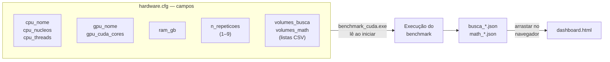
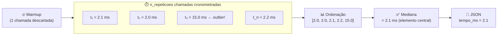
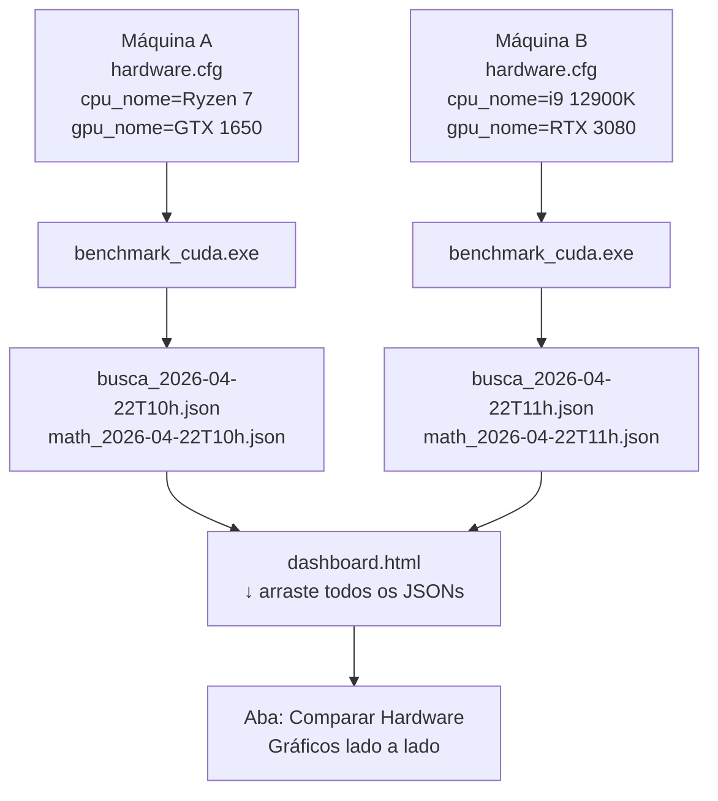
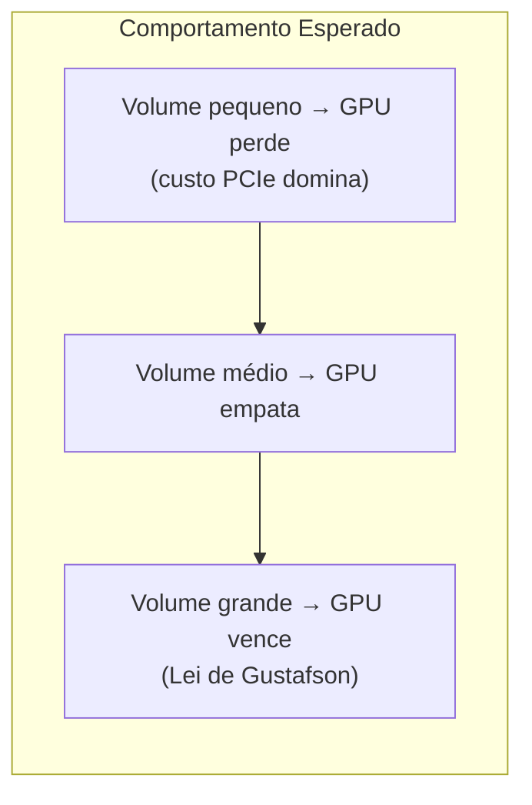

# Dashboard e Configuração do hardware.cfg

Este capítulo ensina como configurar o benchmark para o seu hardware e como interpretar todos os gráficos do dashboard. É o guia prático do projeto — a ponte entre "compilou" e "entendeu os resultados".

---

## 1. O Arquivo `hardware.cfg` — Configuração Completa

Antes de rodar o `benchmark_cuda.exe`, abra o `hardware.cfg` com qualquer editor de texto (Bloco de Notas, VS Code, etc.) e preencha os campos abaixo.



### Referência Completa de Campos

```ini
# ── CPU ─────────────────────────────────────────────────────
cpu_nome=Ryzen 7 4800H        # Texto livre — aparece nos gráficos e JSONs
cpu_nucleos=8                  # Núcleos físicos (sem HyperThreading)
cpu_threads=16                 # Threads lógicas (com HyperThreading/SMT)
                               # O benchmark testa: 1, 2, 4, 8, …, cpu_threads

# ── GPU ─────────────────────────────────────────────────────
gpu_nome=RTX 3060              # Texto livre
gpu_cuda_cores=3584            # CUDA cores — usado como thread count
                               # GTX 1650 = 896 | RTX 3060 = 3584 | RTX 4090 = 16384

# ── MEMÓRIA ─────────────────────────────────────────────────
ram_gb=16                      # RAM livre para o benchmark (não a total do sistema)
                               # Informativo — aparece no JSON como metadado

# ── REPETIÇÕES ──────────────────────────────────────────────
n_repeticoes=3                 # Repetições cronometradas por medição (1 a 9, padrão: 3)
                               # + 1 warmup descartado automaticamente

# ── VOLUMES DE BUSCA ────────────────────────────────────────
volumes_busca=1000,100000,1000000,10000000
# Lista de tamanhos de array a testar. Cada número = quantidade de eventos em memória.
# Cada evento = 96 bytes. Veja tabela de RAM abaixo.

# ── VOLUMES DE MATEMÁTICA ───────────────────────────────────
volumes_math=100000,500000,1000000
# Lista de amostras Monte Carlo / pixels Mandelbrot. Não aloca arrays grandes.
# Mesmo 10.000.000 é seguro em qualquer PC com ≥ 1 GB RAM.
```

### Guia de CUDA Cores por GPU

| GPU | CUDA Cores | Arquitetura | `gpu_cuda_cores` |
|-----|-----------|-------------|-----------------|
| GTX 1650 | 896 | Turing (sm_75) | `896` |
| GTX 1660 Ti | 1536 | Turing (sm_75) | `1536` |
| RTX 3060 | 3584 | Ampere (sm_86) | `3584` |
| RTX 3080 | 8704 | Ampere (sm_86) | `8704` |
| RTX 4070 | 5888 | Ada (sm_89) | `5888` |
| RTX 4090 | 16384 | Ada (sm_89) | `16384` |

---

## 2. Tabela de RAM × Volumes de Busca

Cada `Event` ocupa **96 bytes**. O benchmark mantém o array principal + cópia na VRAM da GPU:

| volumes_busca | RAM bruta | RAM total (com GPU) | Configuração ideal para |
|---------------|-----------|---------------------|------------------------|
| `1000` | ~96 KB | ~200 KB | Qualquer PC — teste rápido |
| `100000` | ~9 MB | ~20 MB | Qualquer PC |
| `1000000` | ~92 MB | ~200 MB | ≥ 2 GB RAM livre |
| `10000000` | ~915 MB | ~2 GB | ≥ 4 GB RAM livre |
| `20000000` | ~1,8 GB | ~4 GB | ≥ 8 GB RAM livre |

> [!tip] Configuração por RAM disponível
> ```ini
> # 2 GB RAM livre
> volumes_busca=1000,100000,1000000
>
> # 4 GB RAM livre (padrão)
> volumes_busca=1000,100000,1000000,10000000
>
> # 8 GB RAM livre (melhor cobertura)
> volumes_busca=1000,100000,1000000,10000000,20000000
> ```

---

## 3. Entendendo as Repetições (`n_repeticoes`)



| `n_repeticoes` | Execuções totais | Confiabilidade | Velocidade |
|----------------|-----------------|----------------|------------|
| `1` | 1 warmup + 1 run | Baixa | Muito rápido |
| `3` | 1 warmup + 3 runs | **Boa** ← recomendado | Rápido |
| `5` | 1 warmup + 5 runs | Muito boa | Moderado |
| `9` | 1 warmup + 9 runs | Máxima | Mais lento |

> [!info] n_repeticoes vs. rodar o benchmark várias vezes
> - **`n_repeticoes`**: Remove outliers **dentro de uma única medição** (antivírus, GC, cache miss).
> - **Rodar o exe várias vezes**: Gera JSONs com timestamps diferentes para comparar cenários (antes/depois de overclock, diferentes configurações de SO, etc.). O dashboard carrega todos ao mesmo tempo.

---

## 4. Como Gerar e Comparar Múltiplas Runs



> [!tip] Passo a Passo
> 1. Edite `hardware.cfg` para a Máquina A e rode o benchmark. Copie os JSONs gerados.
> 2. Edite `hardware.cfg` para a Máquina B (ou use uma máquina diferente) e rode novamente.
> 3. Coloque todos os JSONs na mesma pasta.
> 4. Abra `dashboard.html` no navegador e arraste todos os arquivos de uma vez.
> 5. A aba **"Comparar Hardware"** separará automaticamente cada hardware pelo fingerprint `cpu_nome|gpu_nome|cpu_nucleos`.

---

## 5. As Abas do Dashboard

### 5.1 Busca de Eventos

Exibe os resultados dos algoritmos de busca em arrays de `Event`.

| Seção | O que mostra |
|-------|-------------|
| **Speedup × modo de execução** | Gráfico de barras: serial / openmp / gpu_sim / cuda para um volume selecionado |
| **Speedup × volume** | Gráfico de linha: como o speedup cresce à medida que o array cresce |
| **Tabela Resumo** | Todos os tempos em ms e speedups para todos os volumes e modos |

> [!info] GPU Real vs GPU Sim
> - **gpu_sim**: A CPU simula o comportamento da GPU (valida a matemática). Sempre lento.
> - **cuda (GPU Real)**: A GPU NVIDIA executando de verdade. Só aparece se o exe foi compilado com CUDA (`-DHAS_CUDA`).

### 5.2 Panorama Geral

Visão consolidada de **todo** o hardware carregado no dashboard.

| Seção | O que mostra |
|-------|-------------|
| **Cards de Hardware** | Um card por fingerprint único de hardware com specs resumidas |
| **Tier Cards** | Melhor algoritmo de busca e de matemática para cada hardware |
| **Matriz de Associação** | Heatmap: linhas = algoritmo, colunas = hardware×tipo, valores = speedup |
| **Recomendações** | Para cada combinação algoritmo+hardware, qual modo usar |

### 5.3 Comparar Hardware

Gráficos comparativos entre hardwares diferentes. Ideal para comparações diretas.

| Seção | O que mostra |
|-------|-------------|
| **Speedup OpenMP × Threads** | Curva de escalabilidade de cada hardware (Lei de Amdahl visível!) |
| **Matemática — Speedup OpenMP × Volume** | Como o speedup muda com o volume para Monte Carlo e Mandelbrot |
| **Ranking Geral por Caso de Uso** | Tabela ranqueada por algoritmo — qual hardware+modo vence? |

---

## 6. Interpretando os Resultados

### Speedup × Volume (gráfico de linha)



> [!warning] GPU Real com linha quebrada ou faltando?
> Se a linha "cuda (GPU Real)" não aparecer em um algoritmo, verifique:
> 1. O benchmark foi compilado **com CUDA** (`build_cuda.bat` ou `Makefile` com `-DHAS_CUDA`)?
> 2. O campo `gpu_cuda_cores` no `hardware.cfg` está preenchido corretamente?
> 3. A placa NVIDIA tem drivers instalados?

### Ranking Geral

O ranking pondera **todos** os algoritmos e modos de execução. Um hardware bem ranqueado em Busca Linear com GPU não necessariamente domina em Hash Lookup serial — o ranking mostra o quadro completo.

> [!success] Conclusão prática
> - Para **busca em grandes datasets** (10M+ eventos): use GPU com Busca Linear.
> - Para **cálculos matemáticos** (Monte Carlo, simulações físicas): use sempre GPU — a diferença é brutal.
> - Para **datasets pequenos** (< 100K): CPU com OpenMP costuma ganhar pela latência zero de transferência.

---

## 7. Localizando os Arquivos Gerados

```
simulacao/
└── Dados_simu/
    ├── busca_2026-04-22T10:30:00.json   ← Máquina A, teste de busca
    ├── math_2026-04-22T10:31:00.json    ← Máquina A, teste matemático
    ├── busca_2026-04-22T11:00:00.json   ← Máquina B, teste de busca
    └── math_2026-04-22T11:01:00.json    ← Máquina B, teste matemático
```

> [!tip] Organização por hardware
> Se você testa vários hardwares, crie subpastas por máquina dentro de `Dados_simu/` para não misturar arquivos. O dashboard aceita qualquer JSON arrastado — não precisa estar na mesma pasta.

---
⬅️ Voltar para: [[09 - Medicao e Resultados]]
⬅️ Voltar para: [[Workbench/Faculdade/Arquitetura_2°_Artigo/parallel-laws-benchmark/Benchmark_CUDA/00 - Indice do Projeto]]
